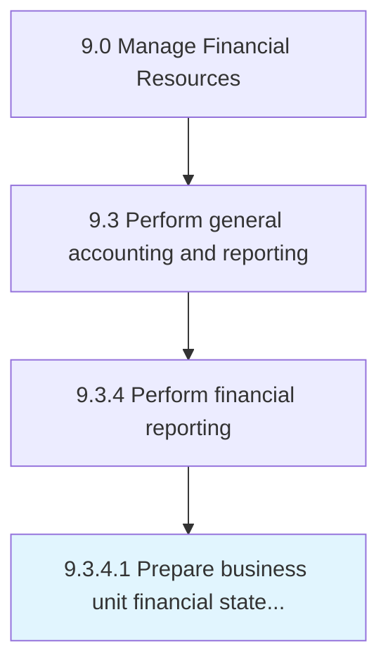

# Prepare business unit financial statements

> Making reports of subsidiaries units to show profits generated from them.

## Overview

Activity 9.3.4.1 is an activity within the Manage Financial Resources framework. 

Making reports of subsidiaries units to show profits generated from them. Prepare financial statements (balance sheets, income statements, cash flow statements and statements of shareholders' equity) for a single unit of a business.

## Process Hierarchy



## Key Statistics

| Metric | Value |
|--------|-------|
| APQC Code | 10837 |
| Hierarchy ID | 9.3.4.1 |
| Level | Activity |
| Parent | [9.3.4](../) |
| Sub-Processes | 0 |


## GraphDL Semantic Structure

```
prepare.BusinessUnitFinancialStatements
```

| Component | Value | Description |
|-----------|-------|-------------|
| Verb | `prepare` | Primary action |
| Object | `business unit financial statements` | Direct object |


## Related Concepts

- BusinessUnitFinancialStatements


---

*Source: APQC PCF 10837 (9.3.4.1) - APQC*
