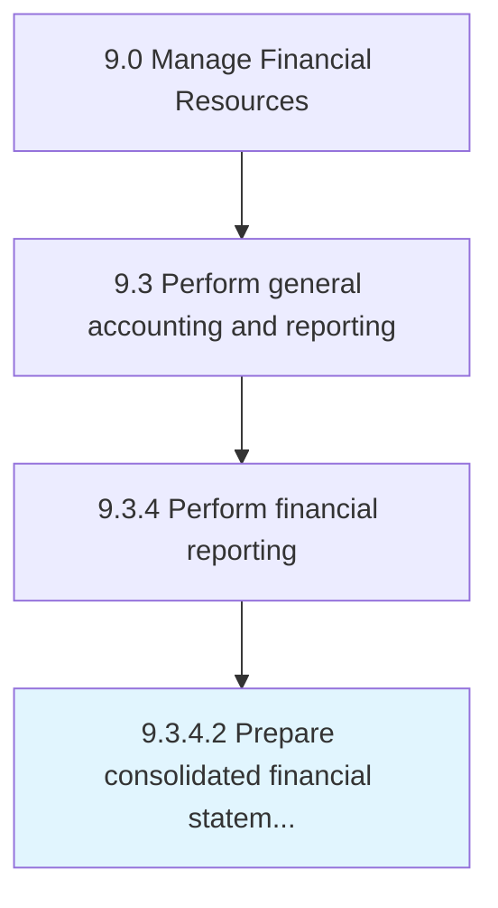

# Prepare consolidated financial statements

> Making final accounts for all units of company together.

## Overview

Activity 9.3.4.2 is an activity within the Manage Financial Resources framework. 

Making final accounts for all units of company together. Prepare combined financial statements of a parent company and its subsidiaries (i.e., separate legal entities controlled by a parent company) showing assets, liabilities, equity, income, expenses, and cash flows.

## Process Hierarchy



## Key Statistics

| Metric | Value |
|--------|-------|
| APQC Code | 10838 |
| Hierarchy ID | 9.3.4.2 |
| Level | Activity |
| Parent | [9.3.4](../) |
| Sub-Processes | 0 |


## GraphDL Semantic Structure

```
prepare.ConsolidatedFinancialStatements
```

| Component | Value | Description |
|-----------|-------|-------------|
| Verb | `prepare` | Primary action |
| Object | `consolidated financial statements` | Direct object |


## Related Concepts

- [ConsolidatedFinancialStatements](/concepts/ConsolidatedFinancialStatements)


---

*Source: APQC PCF 10838 (9.3.4.2) - APQC*
