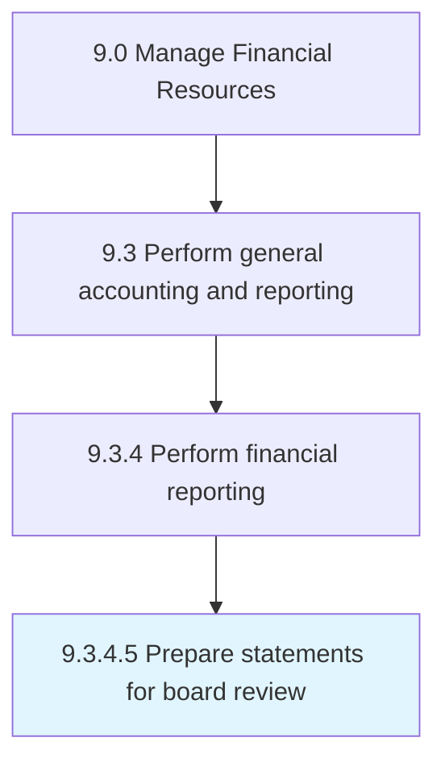

# Prepare statements for board review

> Preparing a draft of financial statements for the board to review before they are sent to the auditor.

## Overview

Activity 9.3.4.5 is an activity within the Manage Financial Resources framework. 

Preparing a draft of financial statements for the board to review before they are sent to the auditor.

## Process Hierarchy



## Key Statistics

| Metric | Value |
|--------|-------|
| APQC Code | 10841 |
| Hierarchy ID | 9.3.4.5 |
| Level | Activity |
| Parent | [9.3.4](../) |
| Sub-Processes | 0 |


## GraphDL Semantic Structure

```
prepare.Statements.for.BoardReview
```

| Component | Value | Description |
|-----------|-------|-------------|
| Verb | `prepare` | Primary action |
| Object | `statements` | Direct object |
| Preposition | `for` | Relationship |
| PrepObject | `board review` | Indirect object |


## Related Concepts

- [Statements](/concepts/Statements)
- [BoardReview](/concepts/BoardReview)


---

*Source: APQC PCF 10841 (9.3.4.5) - APQC*
