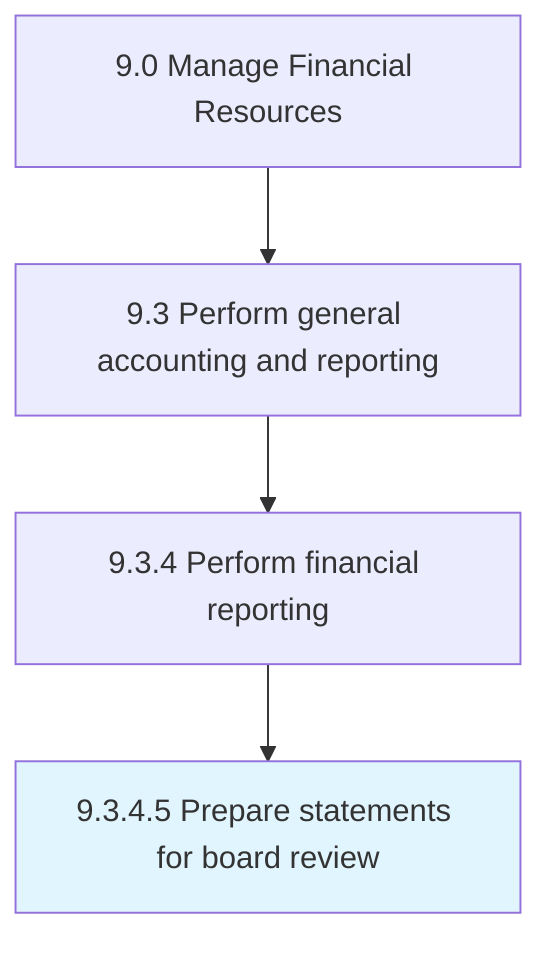
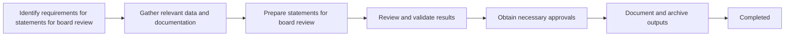

# Prepare statements for board review

> Preparing a draft of financial statements for the board to review before they are sent to the auditor.

## Overview

Activity 9.3.4.5 is an activity within the General Accounting & Reporting domain of the Manage Financial Resources framework.

Preparing a draft of financial statements for the board to review before they are sent to the auditor. This activity plays a critical role in ensuring that the organization maintains sound financial governance, operational efficiency, and regulatory compliance. It supports upstream planning and downstream execution by providing structured outputs that inform decision-making across finance and business operations. Effective execution of this activity requires coordination among finance professionals, process owners, and leadership stakeholders to ensure accuracy, timeliness, and alignment with organizational objectives.

## Process Hierarchy



## Process Flow



## Key Statistics

| Metric | Value |
|--------|-------|
| APQC Code | 10841 |
| Hierarchy ID | 9.3.4.5 |
| Level | Activity |
| Parent | [9.3.4](../) |
| Sub-Processes | 0 |

## GraphDL Semantic Structure

```graphdl
prepare.Statements.for.BoardReview
```

| Component | Value | Description |
|-----------|-------|-------------|
| Verb | `prepare` | Primary action |
| Object | `statements` | Direct object |
| Preposition | `for` | Relationship |
| PrepObject | `board review` | Indirect object |

## RACI Matrix

| Activity | Responsible | Accountable | Consulted | Informed |
|----------|-------------|-------------|-----------|----------|
| Process journal entries | Staff Accountant | Accounting Manager | Department Leads | Controller |
| Prepare financial statements | Senior Accountant | Controller | External Auditors | CFO |
| Perform reconciliations | Staff Accountant | Accounting Manager | Treasury | Controller |

## Related Occupations

- [Financial Managers](/occupations/Management/FinancialManagers)
- [Accountants and Auditors](/occupations/Business/Financial/AccountantsAndAuditors)
- [Financial Analysts](/occupations/Business/Financial/FinancialAnalysts)
- [Bookkeeping Clerks](/occupations/Administrative/BookkeepingAccountingAndAuditingClerks)
- [Chief Financial Officers](/occupations/Management/ChiefExecutives)

## Related Departments

- General Accounting
- Financial Reporting
- Finance & Accounting

## Industry Variations

### Banking

General ledger integrates loan loss provisions, interest accruals, and regulatory reporting under GAAP and IFRS.

### Insurance

Accounting includes claims reserves, premium recognition, and statutory vs. GAAP reporting requirements.

### Government

Uses fund accounting with modified accrual basis and compliance with GASB standards.

## KPIs & Metrics

| Metric | Description | Target |
|--------|-------------|--------|
| Close Cycle Time | Days to complete monthly/quarterly close | < 5 days |
| Journal Entry Error Rate | Percentage of entries requiring correction | < 1% |
| Reporting Timeliness | On-time delivery of financial reports | 100% |
| Audit Adjustments | Number of material audit adjustments | 0 |

## Related Concepts

- Statements
- BoardReview

---

*Source: APQC PCF 10841 (9.3.4.5) - APQC*