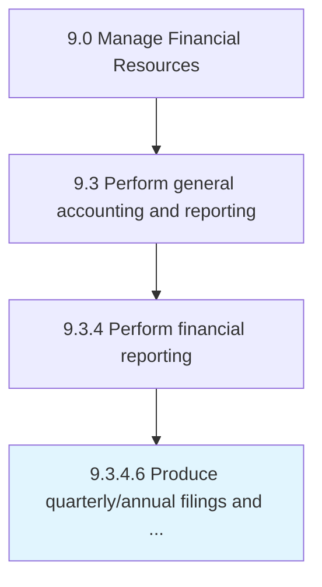

# Produce quarterly/annual filings and shareholder reports

> Making and presenting financial reports to stakeholders.

## Overview

Activity 9.3.4.6 is an activity within the Manage Financial Resources framework. 

Making and presenting financial reports to stakeholders. Create annual and quarterly financial statements for reporting purposes. Prepare shareholder reports with details of the profit-and-loss account, balance sheet, and past year's business activities.

## Process Hierarchy



## Key Statistics

| Metric | Value |
|--------|-------|
| APQC Code | 10842 |
| Hierarchy ID | 9.3.4.6 |
| Level | Activity |
| Parent | [9.3.4](../) |
| Sub-Processes | 0 |


## GraphDL Semantic Structure

```
produce.QuarterlyannualFilingsAndShareholderReports
```

| Component | Value | Description |
|-----------|-------|-------------|
| Verb | `produce` | Primary action |
| Object | `quarterly/annual filings and shareholder reports` | Direct object |


## Related Concepts

- QuarterlyFilingsReports
- AnnualFilingsReports
- ShareholderReports


---

*Source: APQC PCF 10842 (9.3.4.6) - APQC*
