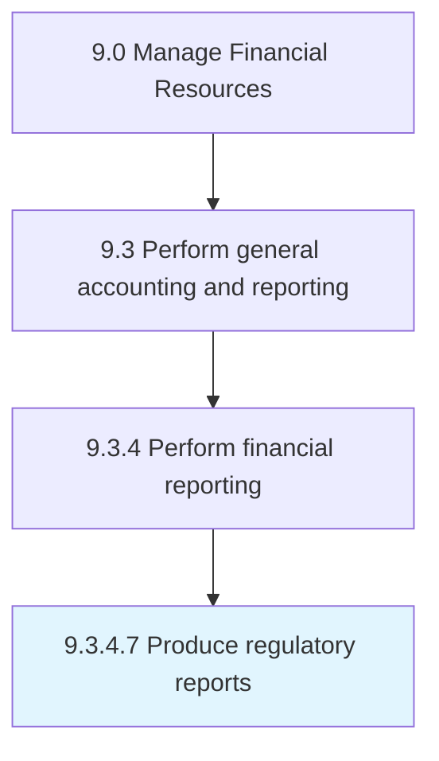

# Produce regulatory reports

> Reporting raw or summary data for final accounts following rules and regulations.

## Overview

Activity 9.3.4.7 is an activity within the Manage Financial Resources framework. 

Reporting raw or summary data for final accounts following rules and regulations.

## Process Hierarchy



## Key Statistics

| Metric | Value |
|--------|-------|
| APQC Code | 10843 |
| Hierarchy ID | 9.3.4.7 |
| Level | Activity |
| Parent | [9.3.4](../) |
| Sub-Processes | 0 |


## GraphDL Semantic Structure

```
produce.RegulatoryReports
```

| Component | Value | Description |
|-----------|-------|-------------|
| Verb | `produce` | Primary action |
| Object | `regulatory reports` | Direct object |


## Related Concepts

- [RegulatoryReports](/concepts/RegulatoryReports)


---

*Source: APQC PCF 10843 (9.3.4.7) - APQC*
