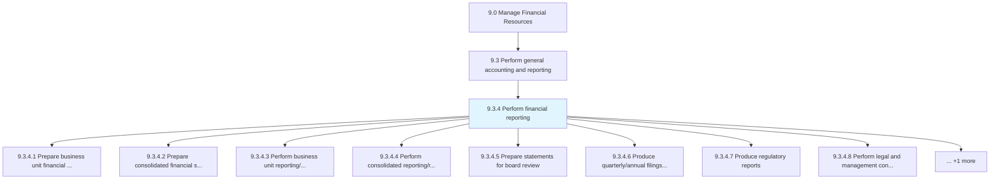
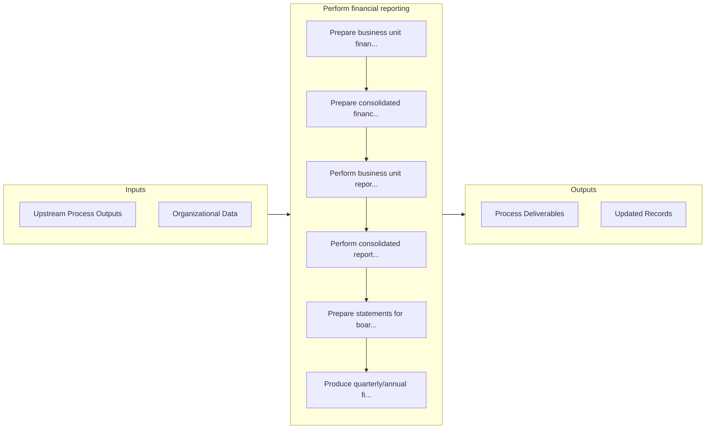

# Perform financial reporting

> Reporting on the organization's financial status to stakeholders.

## Overview

Process 9.3.4 is a core process that defines the specific procedures for perform financial reporting. 

Reporting on the organization's financial status to stakeholders. Include balance sheets, income statements, cash flow statements, and statements of shareholders' equity.

## Process Hierarchy



## Key Statistics

| Metric | Value |
|--------|-------|
| APQC Code | 10750 |
| Hierarchy ID | 9.3.4 |
| Level | Process |
| Parent | [9.3](../) |
| Sub-Processes | 9 |


## GraphDL Semantic Structure

```
perform.FinancialReporting
```

| Component | Value | Description |
|-----------|-------|-------------|
| Verb | `perform` | Primary action |
| Object | `financial reporting` | Direct object |


## Process Flow



## Sub-Processes

| Process | Hierarchy ID | Description |
|---------|-------------|-------------|
| [Prepare business unit financial statements](./PrepareBusinessUnitFinancialStatements) | 9.3.4.1 | Making reports of subsidiaries units to show profits generated from them |
| [Prepare consolidated financial statements](./PrepareConsolidatedFinancialStatements) | 9.3.4.2 | Making final accounts for all units of company together |
| [Perform business unit reporting/review management reports](./PerformBusinessUnitReportingreviewManagementReports) | 9.3.4.3 | Making reports for units/subsidiaries to help management in decision making |
| [Perform consolidated reporting/review of cost management reports](./PerformConsolidatedReportingreviewOfCostManagementReports) | 9.3.4.4 | Making reports for all units to help higher management in decision making |
| [Prepare statements for board review](./PrepareStatementsForBoardReview) | 9.3.4.5 | Preparing a draft of financial statements for the board to review before they are sent to the audito |
| [Produce quarterly/annual filings and shareholder reports](./ProduceQuarterlyannualFilingsAndShareholderReports) | 9.3.4.6 | Making and presenting financial reports to stakeholders |
| [Produce regulatory reports](./ProduceRegulatoryReports) | 9.3.4.7 | Reporting raw or summary data for final accounts following rules and regulations |
| [Perform legal and management consolidation](./PerformLegalAndManagementConsolidation) | 9.3.4.8 | Carrying out activities associated with legal and management consolidation |
| [Manage fixed-asset project accounting](./ManageFixedassetProjectAccounting) | 9.3.4.9 | Managing accounts for large funds-invested projects |


## Related Concepts

- FinancialReporting


---

*Source: APQC PCF 10750 (9.3.4) - APQC*
