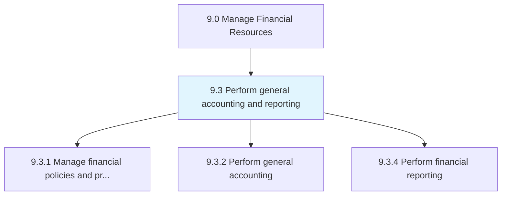
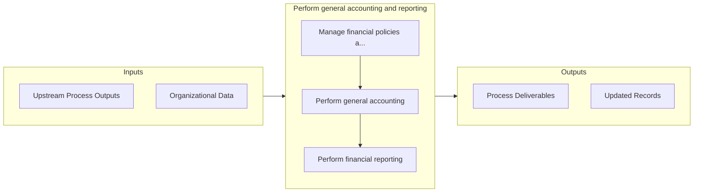

# Perform general accounting and reporting

> Making statements about business activities and functions.

## Overview

Group 9.3 is a process group within APQC Category 9.0 (Manage Financial Resources). 

Making statements about business activities and functions. Prepare financial statements (balance sheet, income statement, statement of cash flows, and statement of stockholders' equity) according to accounting concepts and principles.

## Process Hierarchy



## Key Statistics

| Metric | Value |
|--------|-------|
| APQC Code | 10730 |
| Hierarchy ID | 9.3 |
| Level | Group |
| Parent | [9](../) |
| Sub-Processes | 3 |


## Process Overview

Finance processes manage financial planning, accounting, treasury, and controls to ensure financial health. This process focuses on perform general accounting and reporting, which is essential for organizational effectiveness and achieving business objectives.

## Key Metrics

| Metric | Description | Target |
|--------|-------------|--------|
| Days sales outstanding | Measure of days sales outstanding | Target varies by organization |
| Budget variance | Measure of budget variance | Target varies by organization |
| Cash conversion cycle | Measure of cash conversion cycle | Target varies by organization |
| Cost per transaction | Measure of cost per transaction | Target varies by organization |

## Related Departments

- [Finance](/departments/Finance)
- [Accounting](/departments/Accounting)
- [Treasury](/departments/Treasury)

## Related Occupations

- [Financial Managers](/occupations/Management/FinancialManagers)
- [Accountants](/occupations/Business/AccountantsAndAuditors)
- [Financial Analysts](/occupations/Business/FinancialAnalysts)

## RACI Matrix

| Activity | Responsible | Accountable | Consulted | Informed |
|----------|-------------|-------------|-----------|----------|
| Plan | Process Owner | Manager | Stakeholders | Team |
| Execute | Team | Process Owner | Manager | Stakeholders |
| Monitor | Analyst | Manager | Process Owner | Leadership |
| Improve | Process Owner | Manager | Team | Stakeholders |

## GraphDL Semantic Structure

```graphdl
perform.GeneralAccountingAndReporting
```

| Component | Value | Description |
|-----------|-------|-------------|
| Verb | `perform` | Primary action |
| Object | `general accounting and reporting` | Direct object |


## Process Flow



## Sub-Processes

| Process | Hierarchy ID | Description |
|---------|-------------|-------------|
| [Manage financial policies and procedures](./9.3.1-ManageFinancialPoliciesProcedures/) | 9.3.1 | Creating procedures to perform general accounting and reporting |
| [Perform general accounting](./9.3.2-PerformGeneralAccounting/) | 9.3.2 | Applying basic principles, concepts, and accounting practices in recording and preparing final accou |
| [Perform financial reporting](./9.3.4-PerformFinancialReporting/) | 9.3.4 | Reporting on the organization's financial status to stakeholders |


## Related Concepts

- GeneralAccounting
- Reporting


---

*Source: APQC PCF 10730 (9.3) - APQC*
