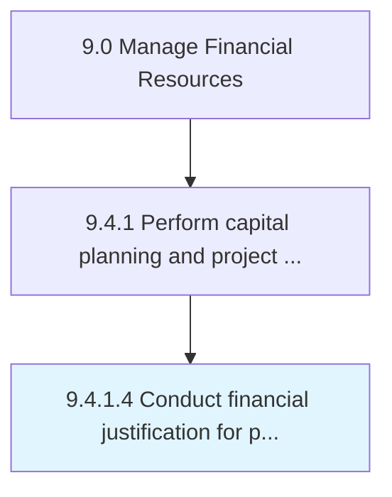

# Conduct financial justification for project approval

> Reviewing all project business cases in order to substantiate projected financial gains.

## Overview

Activity 9.4.1.4 is an activity within the Manage Financial Resources framework. 

Reviewing all project business cases in order to substantiate projected financial gains. Validate any project's business case. Juxtapose the benefits derived from moving a project forward against the associated costs.

## Process Hierarchy



## Key Statistics

| Metric | Value |
|--------|-------|
| APQC Code | 10847 |
| Hierarchy ID | 9.4.1.4 |
| Level | Activity |
| Parent | [9.4.1](../) |
| Sub-Processes | 0 |


## GraphDL Semantic Structure

```
conduct.FinancialJustification.for.ProjectApproval
```

| Component | Value | Description |
|-----------|-------|-------------|
| Verb | `conduct` | Primary action |
| Object | `financial justification` | Direct object |
| Preposition | `for` | Relationship |
| PrepObject | `project approval` | Indirect object |


## Related Concepts

- [FinancialJustification](/concepts/FinancialJustification)
- [ProjectApproval](/concepts/ProjectApproval)


---

*Source: APQC PCF 10847 (9.4.1.4) - APQC*
