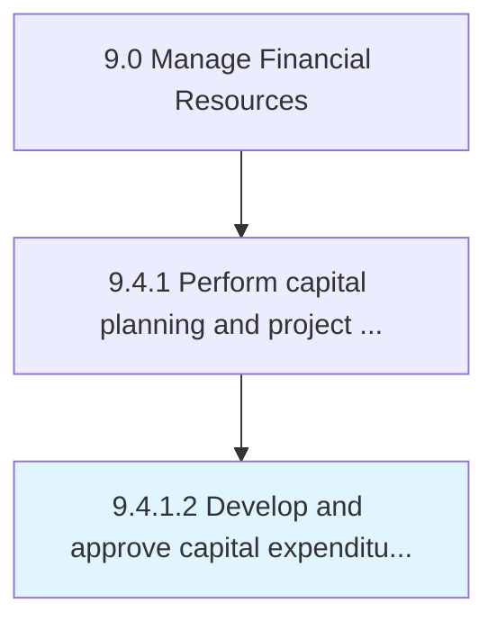

# Develop and approve capital expenditure plans and budgets

> Creating budgets, and soliciting approvals for capital projects.

## Overview

Activity 9.4.1.2 is an activity within the Manage Financial Resources framework. 

Creating budgets, and soliciting approvals for capital projects. Prepare budgets for projects that require heavy investments. Secure approvals from management.

## Process Hierarchy



## Key Statistics

| Metric | Value |
|--------|-------|
| APQC Code | 10845 |
| Hierarchy ID | 9.4.1.2 |
| Level | Activity |
| Parent | [9.4.1](../) |
| Sub-Processes | 0 |


## GraphDL Semantic Structure

```
develop.AndApproveCapitalExpenditurePlansAndBudgets
```

| Component | Value | Description |
|-----------|-------|-------------|
| Verb | `develop` | Primary action |
| Object | `and approve capital expenditure plans and budgets` | Direct object |


## Related Concepts

- [CapitalExpenditurePlans](/concepts/CapitalExpenditurePlans)
- [Budgets](/concepts/Budgets)
- [CapitalExpenditurePlans](/concepts/CapitalExpenditurePlans)
- [Budgets](/concepts/Budgets)


---

*Source: APQC PCF 10845 (9.4.1.2) - APQC*
