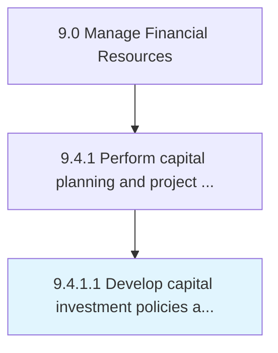

# Develop capital investment policies and procedures

> Creating procedures and policies to follow for investing in capital projects.

## Overview

Activity 9.4.1.1 is an activity within the Manage Financial Resources framework. 

Creating procedures and policies to follow for investing in capital projects. Create rules and regulations regarding large investment plans, which require in-depth forecasting for expenditure and revenue.

## Process Hierarchy



## Key Statistics

| Metric | Value |
|--------|-------|
| APQC Code | 10844 |
| Hierarchy ID | 9.4.1.1 |
| Level | Activity |
| Parent | [9.4.1](../) |
| Sub-Processes | 0 |


## GraphDL Semantic Structure

```
develop.CapitalInvestmentPoliciesAndProcedures
```

| Component | Value | Description |
|-----------|-------|-------------|
| Verb | `develop` | Primary action |
| Object | `capital investment policies and procedures` | Direct object |


## Related Concepts

- [CapitalInvestmentPolicies](/concepts/CapitalInvestmentPolicies)
- [Procedures](/concepts/Procedures)


---

*Source: APQC PCF 10844 (9.4.1.1) - APQC*
