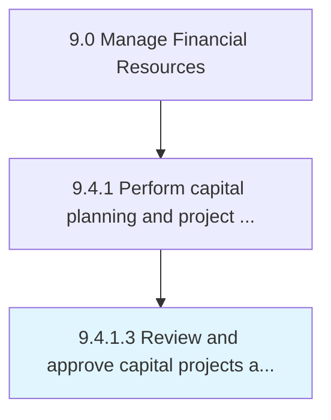

# Review and approve capital projects and fixed-asset acquisitions

> Evaluating and supporting capital investments in projects and fixed assets.

## Overview

Activity 9.4.1.3 is an activity within the Manage Financial Resources framework. 

Evaluating and supporting capital investments in projects and fixed assets. Confirm details of capital projects. Secure approvals from managements for large investments.

## Process Hierarchy



## Key Statistics

| Metric | Value |
|--------|-------|
| APQC Code | 10846 |
| Hierarchy ID | 9.4.1.3 |
| Level | Activity |
| Parent | [9.4.1](../) |
| Sub-Processes | 0 |


## GraphDL Semantic Structure

```
review.AndApproveCapitalProjectsAndFixedassetAcquisitions
```

| Component | Value | Description |
|-----------|-------|-------------|
| Verb | `review` | Primary action |
| Object | `and approve capital projects and fixed-asset acquisitions` | Direct object |


---

*Source: APQC PCF 10846 (9.4.1.3) - APQC*
