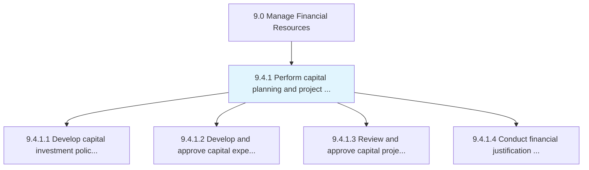
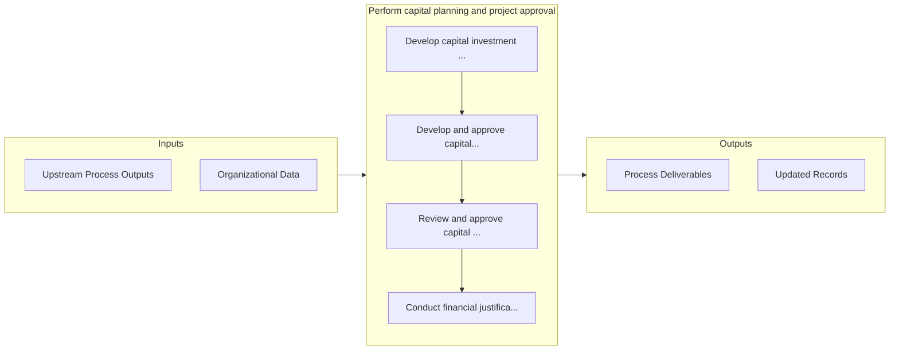

# Perform capital planning and project approval

> Preparing a project finance report to solicit approvals in capital projects.

## Overview

Process 9.4.1 is a core process that defines the specific procedures for perform capital planning and project approval. 

Preparing a project finance report to solicit approvals in capital projects. Prepare budgets for projects that require heavy investments. Report on project finances to solicit approvals from management.

## Process Hierarchy



## Key Statistics

| Metric | Value |
|--------|-------|
| APQC Code | 10751 |
| Hierarchy ID | 9.4.1 |
| Level | Process |
| Parent | [9.4](../) |
| Sub-Processes | 4 |


## GraphDL Semantic Structure

```graphdl
perform.CapitalPlanningAndProjectApproval
```

| Component | Value | Description |
|-----------|-------|-------------|
| Verb | `perform` | Primary action |
| Object | `capital planning and project approval` | Direct object |


## Process Flow



## Sub-Processes

| Process | Hierarchy ID | Description |
|---------|-------------|-------------|
| [Develop capital investment policies and procedures](./DevelopCapitalInvestmentPoliciesAndProcedures) | 9.4.1.1 | Creating procedures and policies to follow for investing in capital projects |
| [Develop and approve capital expenditure plans and budgets](./DevelopAndApproveCapitalExpenditurePlansAndBudgets) | 9.4.1.2 | Creating budgets, and soliciting approvals for capital projects |
| [Review and approve capital projects and fixed-asset acquisitions](./ReviewAndApproveCapitalProjectsAndFixedassetAcquisitions) | 9.4.1.3 | Evaluating and supporting capital investments in projects and fixed assets |
| [Conduct financial justification for project approval](./ConductFinancialJustificationForProjectApproval) | 9.4.1.4 | Reviewing all project business cases in order to substantiate projected financial gains |


## Related Concepts

- CapitalPlanning
- ProjectApproval


---

*Source: APQC PCF 10751 (9.4.1) - APQC*
