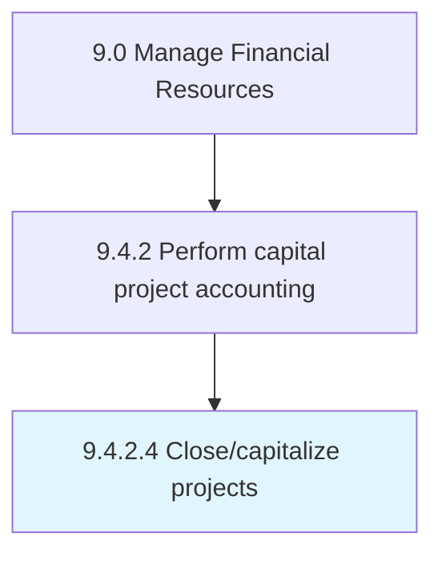

# Close/capitalize projects

> Checking for returns generated from projects for decision making.

## Overview

Activity 9.4.2.4 is an activity within the Manage Financial Resources framework. 

Checking for returns generated from projects for decision making. Evaluate capital projects that require heavy investments. Decide whether to proceed based on the revenues generated.

## Process Hierarchy



## Key Statistics

| Metric | Value |
|--------|-------|
| APQC Code | 10851 |
| Hierarchy ID | 9.4.2.4 |
| Level | Activity |
| Parent | [9.4.2](../) |
| Sub-Processes | 0 |


## GraphDL Semantic Structure

```
close/capitalize.Projects
```

| Component | Value | Description |
|-----------|-------|-------------|
| Verb | `close/capitalize` | Primary action |
| Object | `projects` | Direct object |


## Related Concepts

- [/CapitalizeProjects](/concepts//CapitalizeProjects)


---

*Source: APQC PCF 10851 (9.4.2.4) - APQC*
