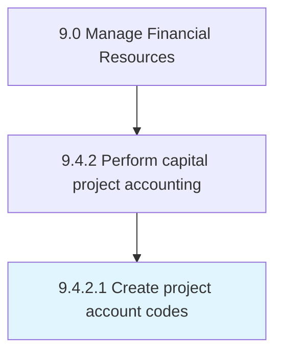

# Create project account codes

> Giving reference codes for every project.

## Overview

Activity 9.4.2.1 is an activity within the Manage Financial Resources framework. 

## Process Hierarchy



## Key Statistics

| Metric | Value |
|--------|-------|
| APQC Code | 10848 |
| Hierarchy ID | 9.4.2.1 |
| Level | Activity |
| Parent | [9.4.2](../) |
| Sub-Processes | 0 |


## GraphDL Semantic Structure

```
create.ProjectAccountCodes
```

| Component | Value | Description |
|-----------|-------|-------------|
| Verb | `create` | Primary action |
| Object | `project account codes` | Direct object |


## Related Concepts

- ProjectAccountCodes


---

*Source: APQC PCF 10848 (9.4.2.1) - APQC*
