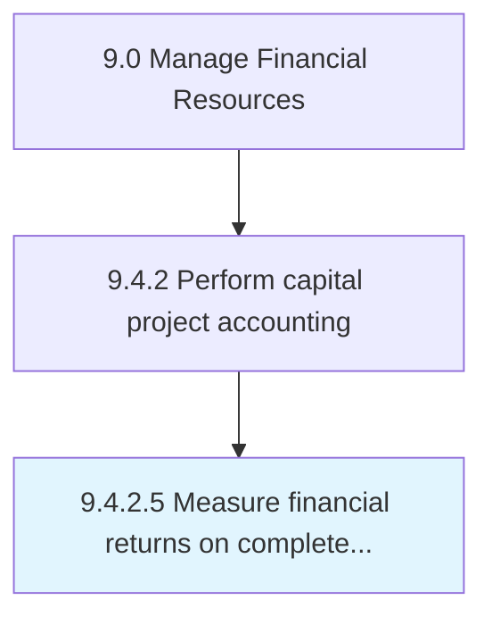

# Measure financial returns on completed capital projects

> Comparing a finished project's profitability with forecasted returns.

## Overview

Activity 9.4.2.5 is an activity within the Manage Financial Resources framework. 

Comparing a finished project's profitability with forecasted returns. Scrutinize revenues generated by completed projects that required heavy investments. Determine profitability.

## Process Hierarchy



## Key Statistics

| Metric | Value |
|--------|-------|
| APQC Code | 10852 |
| Hierarchy ID | 9.4.2.5 |
| Level | Activity |
| Parent | [9.4.2](../) |
| Sub-Processes | 0 |


## GraphDL Semantic Structure

```
measure.FinancialReturns.on.CompletedCapitalProjects
```

| Component | Value | Description |
|-----------|-------|-------------|
| Verb | `measure` | Primary action |
| Object | `financial returns` | Direct object |
| Preposition | `on` | Relationship |
| PrepObject | `completed capital projects` | Indirect object |


## Related Concepts

- [FinancialReturns](/concepts/FinancialReturns)
- [CompletedCapitalProjects](/concepts/CompletedCapitalProjects)


---

*Source: APQC PCF 10852 (9.4.2.5) - APQC*
