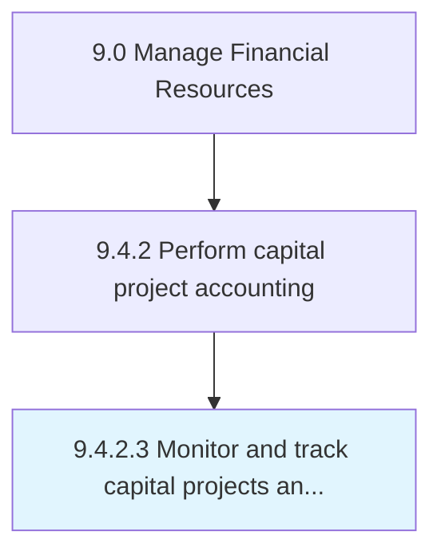
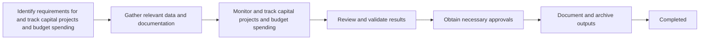

# Monitor and track capital projects and budget spending

> Evaluating project progress and funds invested.

## Overview

Activity 9.4.2.3 is an activity within the Fixed Asset Management domain of the Manage Financial Resources framework.

Evaluating project progress and funds invested. This activity plays a critical role in ensuring that the organization maintains sound financial governance, operational efficiency, and regulatory compliance. It supports upstream planning and downstream execution by providing structured outputs that inform decision-making across finance and business operations. Effective execution of this activity requires coordination among finance professionals, process owners, and leadership stakeholders to ensure accuracy, timeliness, and alignment with organizational objectives.

## Process Hierarchy



## Process Flow



## Key Statistics

| Metric | Value |
|--------|-------|
| APQC Code | 10850 |
| Hierarchy ID | 9.4.2.3 |
| Level | Activity |
| Parent | [9.4.2](../) |
| Sub-Processes | 0 |

## GraphDL Semantic Structure

```
monitor.AndTrackCapitalProjectsAndBudgetSpending
```

| Component | Value | Description |
|-----------|-------|-------------|
| Verb | `monitor` | Primary action |
| Object | `and track capital projects and budget spending` | Direct object |

## RACI Matrix

| Activity | Responsible | Accountable | Consulted | Informed |
|----------|-------------|-------------|-----------|----------|
| Record asset acquisitions | Fixed Asset Accountant | Accounting Manager | Procurement | Controller |
| Calculate depreciation | Fixed Asset Accountant | Controller | Tax Department | CFO |
| Perform physical inventory | Asset Coordinator | Fixed Asset Manager | Facilities | Controller |

## Related Occupations

- [Financial Managers](/occupations/FinancialManagers)
- [Accountants and Auditors](/occupations/AccountantsAndAuditors)
- [Financial Analysts](/occupations/FinancialAnalysts)
- [Property Managers](/occupations/PropertyRealEstateAndCommunityAssociationManagers)
- [Purchasing Managers](/occupations/PurchasingManagers)

## Related Departments

- Fixed Assets
- Facilities Management
- Finance & Accounting

## Industry Variations

### Manufacturing

Asset tracking covers production equipment, tooling, and molds with complex depreciation schedules and impairment testing.

### Utilities

Manages large-scale infrastructure assets (power plants, grids) with regulatory rate-base accounting and long-lived asset tracking.

### Real Estate

Focuses on property valuation, lease accounting (ASC 842), and capital improvement tracking.

## KPIs & Metrics

| Metric | Description | Target |
|--------|-------------|--------|
| Asset Utilization Rate | Percentage of assets actively in use | > 85% |
| Depreciation Accuracy | Accuracy of depreciation calculations | > 99% |
| Asset Register Completeness | Percentage of assets properly recorded | 100% |
| Return on Assets (ROA) | Net income relative to total assets | Industry benchmark |

## Related Concepts

- CapitalProjects
- BudgetSpending
- CapitalProjects
- BudgetSpending

---

*Source: APQC PCF 10850 (9.4.2.3) - APQC*