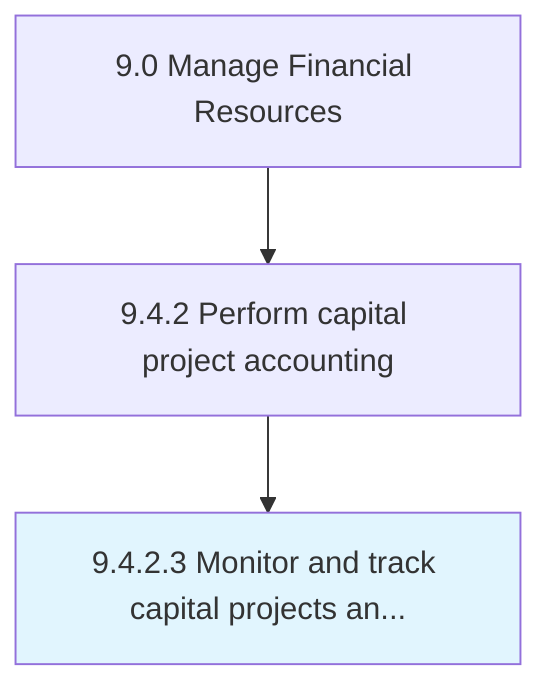

# Monitor and track capital projects and budget spending

> Evaluating project progress and funds invested.

## Overview

Activity 9.4.2.3 is an activity within the Manage Financial Resources framework. 

Evaluating project progress and funds invested. Observe and track significant funds invested on any long-term project. Compare to budget.

## Process Hierarchy



## Key Statistics

| Metric | Value |
|--------|-------|
| APQC Code | 10850 |
| Hierarchy ID | 9.4.2.3 |
| Level | Activity |
| Parent | [9.4.2](../) |
| Sub-Processes | 0 |


## GraphDL Semantic Structure

```
monitor.AndTrackCapitalProjectsAndBudgetSpending
```

| Component | Value | Description |
|-----------|-------|-------------|
| Verb | `monitor` | Primary action |
| Object | `and track capital projects and budget spending` | Direct object |


## Related Concepts

- [CapitalProjects](/concepts/CapitalProjects)
- [BudgetSpending](/concepts/BudgetSpending)
- [CapitalProjects](/concepts/CapitalProjects)
- [BudgetSpending](/concepts/BudgetSpending)


---

*Source: APQC PCF 10850 (9.4.2.3) - APQC*
