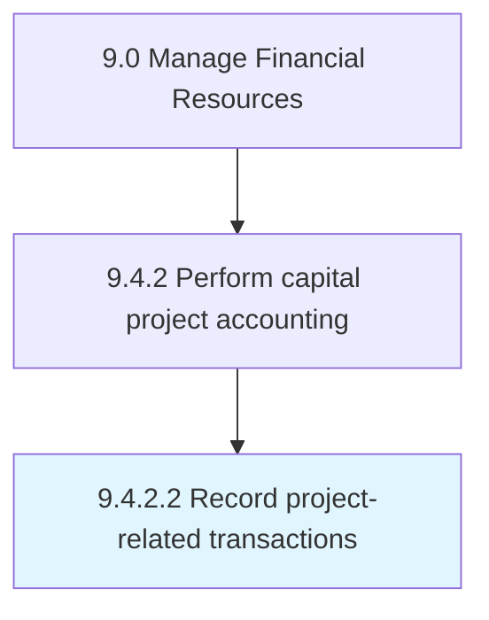

# Record project-related transactions

> Noting every transaction during a project in a common financial database.

## Overview

Activity 9.4.2.2 is an activity within the Manage Financial Resources framework. 

Noting every transaction during a project in a common financial database. Document all transactions associated with any project. Maintain a centralized repository of all such financial data.

## Process Hierarchy



## Key Statistics

| Metric | Value |
|--------|-------|
| APQC Code | 10849 |
| Hierarchy ID | 9.4.2.2 |
| Level | Activity |
| Parent | [9.4.2](../) |
| Sub-Processes | 0 |


## GraphDL Semantic Structure

```
record.ProjectrelatedTransactions
```

| Component | Value | Description |
|-----------|-------|-------------|
| Verb | `record` | Primary action |
| Object | `project-related transactions` | Direct object |


---

*Source: APQC PCF 10849 (9.4.2.2) - APQC*
