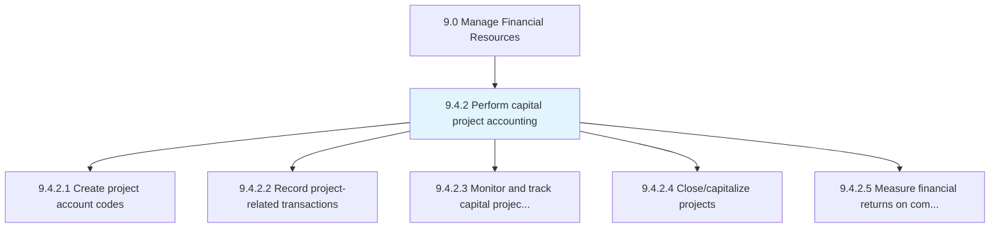
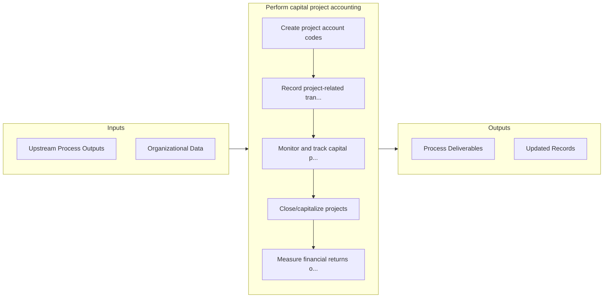

# Perform capital project accounting

> Accounting for large-scale and large-cost investments.

## Overview

Process 9.4.2 is a core process that defines the specific procedures for perform capital project accounting. 

Accounting for large-scale and large-cost investments. Manage and account for ongoing activities related to capital projects, including setting up new projects, recording project transactions, monitoring and tracking spending, closing and capitalizing projects, and measuring the financial returns on completed projects.

## Process Hierarchy



## Key Statistics

| Metric | Value |
|--------|-------|
| APQC Code | 10752 |
| Hierarchy ID | 9.4.2 |
| Level | Process |
| Parent | [9.4](../) |
| Sub-Processes | 5 |


## GraphDL Semantic Structure

```graphdl
perform.CapitalProjectAccounting
```

| Component | Value | Description |
|-----------|-------|-------------|
| Verb | `perform` | Primary action |
| Object | `capital project accounting` | Direct object |


## Process Flow



## Sub-Processes

| Process | Hierarchy ID | Description |
|---------|-------------|-------------|
| [Create project account codes](./CreateProjectAccountCodes) | 9.4.2.1 | Giving reference codes for every project |
| [Record project-related transactions](./RecordProjectrelatedTransactions) | 9.4.2.2 | Noting every transaction during a project in a common financial database |
| [Monitor and track capital projects and budget spending](./MonitorAndTrackCapitalProjectsAndBudgetSpending) | 9.4.2.3 | Evaluating project progress and funds invested |
| [Close/capitalize projects](./ClosecapitalizeProjects) | 9.4.2.4 | Checking for returns generated from projects for decision making |
| [Measure financial returns on completed capital projects](./MeasureFinancialReturnsOnCompletedCapitalProjects) | 9.4.2.5 | Comparing a finished project's profitability with forecasted returns |


## Related Concepts

- CapitalProjectAccounting


---

*Source: APQC PCF 10752 (9.4.2) - APQC*
