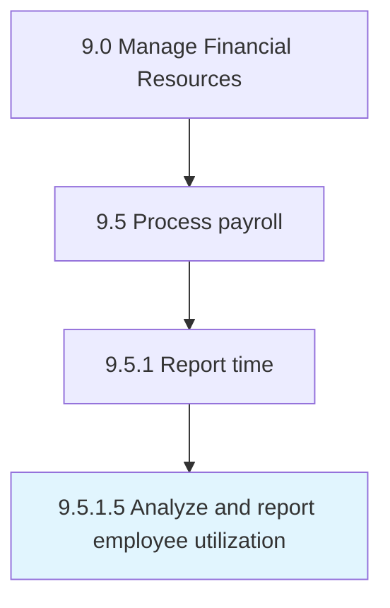

# Analyze and report employee utilization

> Monitoring the number of productive hours for employees.

## Overview

Activity 9.5.1.5 is an activity within the Manage Financial Resources framework. 

Monitoring the number of productive hours for employees.

## Process Hierarchy



## Key Statistics

| Metric | Value |
|--------|-------|
| APQC Code | 10857 |
| Hierarchy ID | 9.5.1.5 |
| Level | Activity |
| Parent | [9.5.1](../) |
| Sub-Processes | 0 |


## GraphDL Semantic Structure

```
analyze.AndReportEmployeeUtilization
```

| Component | Value | Description |
|-----------|-------|-------------|
| Verb | `analyze` | Primary action |
| Object | `and report employee utilization` | Direct object |


## Related Concepts

- EmployeeUtilization
- EmployeeUtilization


---

*Source: APQC PCF 10857 (9.5.1.5) - APQC*
