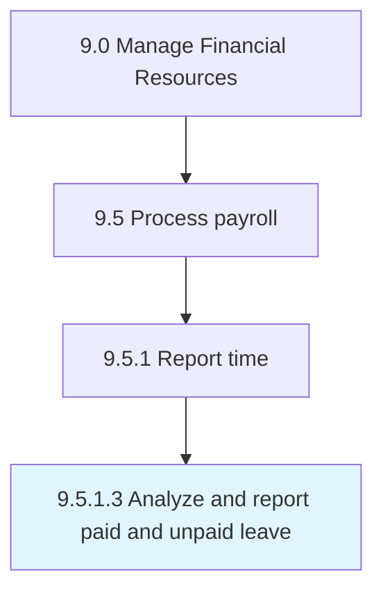

# Analyze and report paid and unpaid leave

> Tracking leaves allowed and taken by employees.

## Overview

Activity 9.5.1.3 is an activity within the Manage Financial Resources framework. 

## Process Hierarchy



## Key Statistics

| Metric | Value |
|--------|-------|
| APQC Code | 10855 |
| Hierarchy ID | 9.5.1.3 |
| Level | Activity |
| Parent | [9.5.1](../) |
| Sub-Processes | 0 |


## GraphDL Semantic Structure

```
analyze.AndReportPaidAndUnpaidLeave
```

| Component | Value | Description |
|-----------|-------|-------------|
| Verb | `analyze` | Primary action |
| Object | `and report paid and unpaid leave` | Direct object |


## Related Concepts

- [PaidLeave](/concepts/PaidLeave)
- [UnpaidLeave](/concepts/UnpaidLeave)
- [PaidLeave](/concepts/PaidLeave)
- [UnpaidLeave](/concepts/UnpaidLeave)


---

*Source: APQC PCF 10855 (9.5.1.3) - APQC*
