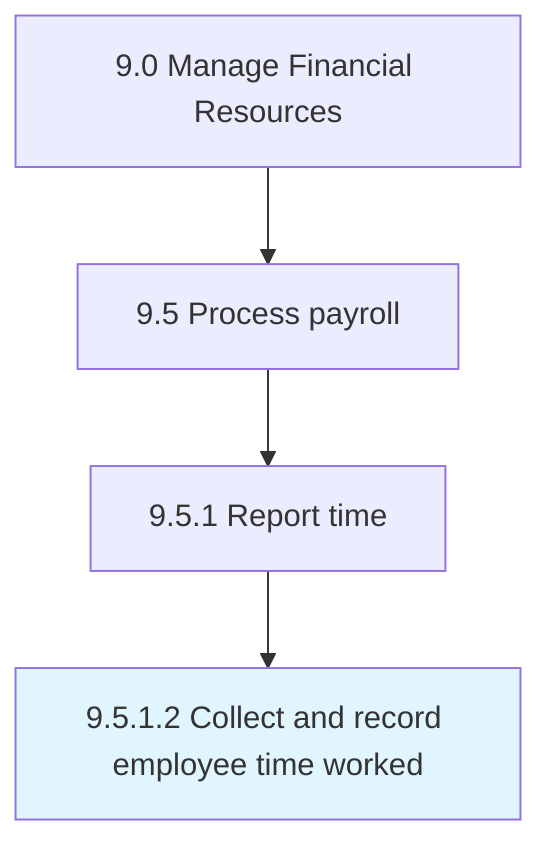

# Collect and record employee time worked

> Tracking billing hours of each employee on daily basis.

## Overview

Activity 9.5.1.2 is an activity within the Manage Financial Resources framework. 

Tracking billing hours of each employee on daily basis.

## Process Hierarchy



## Key Statistics

| Metric | Value |
|--------|-------|
| APQC Code | 10854 |
| Hierarchy ID | 9.5.1.2 |
| Level | Activity |
| Parent | [9.5.1](../) |
| Sub-Processes | 0 |


## GraphDL Semantic Structure

```
collect.AndRecordEmployeeTimeWorked
```

| Component | Value | Description |
|-----------|-------|-------------|
| Verb | `collect` | Primary action |
| Object | `and record employee time worked` | Direct object |


## Related Concepts

- [EmployeeTimeWorked](/concepts/EmployeeTimeWorked)
- [EmployeeTimeWorked](/concepts/EmployeeTimeWorked)


---

*Source: APQC PCF 10854 (9.5.1.2) - APQC*
