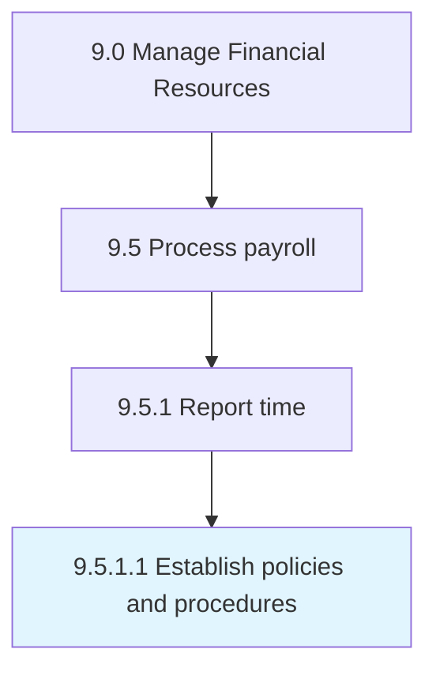

# Establish policies and procedures

> Developing policies and procedures for the HR function to calculate compensation.

## Overview

Activity 9.5.1.1 is an activity within the Manage Financial Resources framework. 

Developing policies and procedures for the HR function to calculate compensation.

## Process Hierarchy



## Key Statistics

| Metric | Value |
|--------|-------|
| APQC Code | 10853 |
| Hierarchy ID | 9.5.1.1 |
| Level | Activity |
| Parent | [9.5.1](../) |
| Sub-Processes | 0 |


## GraphDL Semantic Structure

```
establish.PoliciesAndProcedures
```

| Component | Value | Description |
|-----------|-------|-------------|
| Verb | `establish` | Primary action |
| Object | `policies and procedures` | Direct object |


## Related Concepts

- [Policies](/concepts/Policies)
- [Procedures](/concepts/Procedures)


---

*Source: APQC PCF 10853 (9.5.1.1) - APQC*
