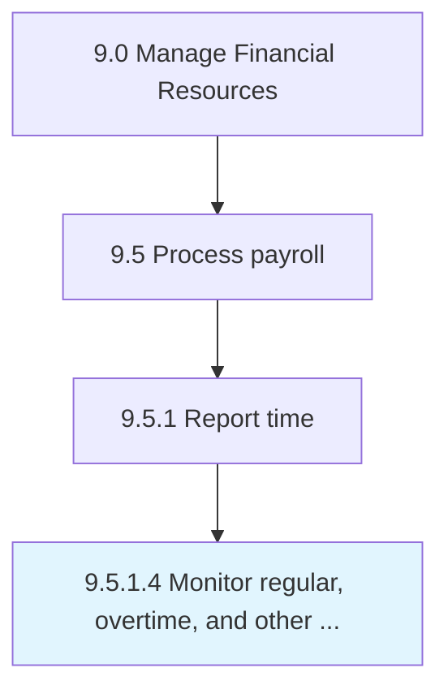

# Monitor regular, overtime, and other hours

> Observing the number of hours worked by an employees on daily basis.

## Overview

Activity 9.5.1.4 is an activity within the Manage Financial Resources framework. 

Observing the number of hours worked by an employees on daily basis. Track the number of hours worked by an employee, as well as the number of hours worked beyond normal working hour's according to company standards.

## Process Hierarchy



## Key Statistics

| Metric | Value |
|--------|-------|
| APQC Code | 10856 |
| Hierarchy ID | 9.5.1.4 |
| Level | Activity |
| Parent | [9.5.1](../) |
| Sub-Processes | 0 |


## GraphDL Semantic Structure

```
monitor.RegularOvertimeAndOtherHours
```

| Component | Value | Description |
|-----------|-------|-------------|
| Verb | `monitor` | Primary action |
| Object | `regular, overtime, and other hours` | Direct object |


## Related Concepts

- [Regular](/concepts/Regular)
- [Overtime](/concepts/Overtime)
- [OtherHours](/concepts/OtherHours)


---

*Source: APQC PCF 10856 (9.5.1.4) - APQC*
