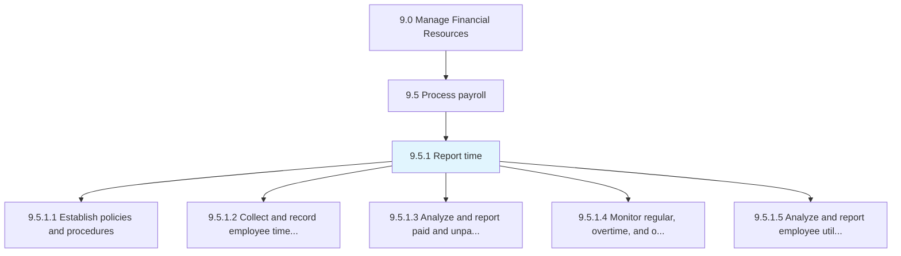
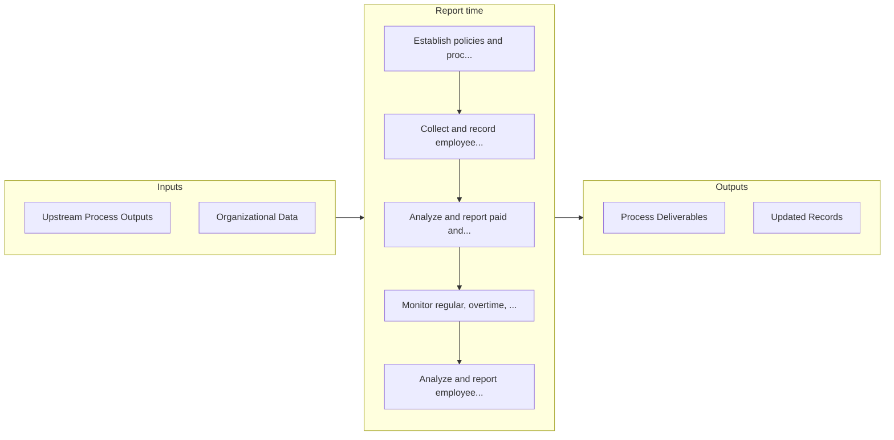

# Report time

> Recording the reporting time of employees on-site.

## Overview

Process 9.5.1 is a core process that defines the specific procedures for report time. 

Recording the reporting time of employees on-site. Track working days, salary calculations, holidays taken, number of hours spend in the office, billing hours, etc.

## Process Hierarchy



## Key Statistics

| Metric | Value |
|--------|-------|
| APQC Code | 10753 |
| Hierarchy ID | 9.5.1 |
| Level | Process |
| Parent | [9.5](../) |
| Sub-Processes | 5 |


## Process Overview

Finance processes manage financial planning, accounting, treasury, and controls to ensure financial health. This process focuses on report time, which is essential for organizational effectiveness and achieving business objectives.

## Key Metrics

| Metric | Description | Target |
|--------|-------------|--------|
| Days sales outstanding | Measure of days sales outstanding | Target varies by organization |
| Budget variance | Measure of budget variance | Target varies by organization |
| Cash conversion cycle | Measure of cash conversion cycle | Target varies by organization |
| Cost per transaction | Measure of cost per transaction | Target varies by organization |

## Related Departments

- [Finance](/departments/Finance)
- [Accounting](/departments/Accounting)
- [Treasury](/departments/Treasury)

## Related Occupations

- [Financial Managers](/occupations/Management/FinancialManagers)
- [Accountants](/occupations/Business/AccountantsAndAuditors)
- [Financial Analysts](/occupations/Business/FinancialAnalysts)

## RACI Matrix

| Activity | Responsible | Accountable | Consulted | Informed |
|----------|-------------|-------------|-----------|----------|
| Plan | Process Owner | Manager | Stakeholders | Team |
| Execute | Team | Process Owner | Manager | Stakeholders |
| Monitor | Analyst | Manager | Process Owner | Leadership |
| Improve | Process Owner | Manager | Team | Stakeholders |

## GraphDL Semantic Structure

```graphdl
report.Time
```

| Component | Value | Description |
|-----------|-------|-------------|
| Verb | `report` | Primary action |
| Object | `time` | Direct object |


## Process Flow



## Sub-Processes

| Process | Hierarchy ID | Description |
|---------|-------------|-------------|
| [Establish policies and procedures](./EstablishPoliciesAndProcedures) | 9.5.1.1 | Developing policies and procedures for the HR function to calculate compensation |
| [Collect and record employee time worked](./CollectAndRecordEmployeeTimeWorked) | 9.5.1.2 | Tracking billing hours of each employee on daily basis |
| [Analyze and report paid and unpaid leave](./AnalyzeAndReportPaidAndUnpaidLeave) | 9.5.1.3 | Tracking leaves allowed and taken by employees |
| [Monitor regular, overtime, and other hours](./MonitorRegularOvertimeAndOtherHours) | 9.5.1.4 | Observing the number of hours worked by an employees on daily basis |
| [Analyze and report employee utilization](./AnalyzeAndReportEmployeeUtilization) | 9.5.1.5 | Monitoring the number of productive hours for employees |


## Related Concepts

- Time


---

*Source: APQC PCF 10753 (9.5.1) - APQC*
