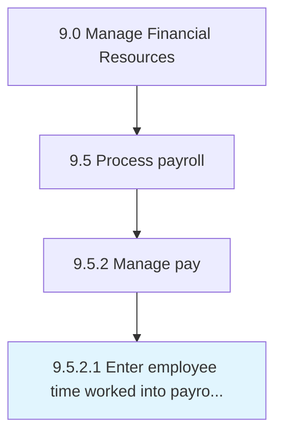

# Enter employee time worked into payroll system

> Tracking the number of hours worked for the payroll system.

## Overview

Activity 9.5.2.1 is an activity within the Manage Financial Resources framework. 

Tracking the number of hours worked for the payroll system. Register the number of hours worked by an employee into the payroll system for the purpose of calculating salaries or wages.

## Process Hierarchy



## Key Statistics

| Metric | Value |
|--------|-------|
| APQC Code | 10858 |
| Hierarchy ID | 9.5.2.1 |
| Level | Activity |
| Parent | [9.5.2](../) |
| Sub-Processes | 0 |


## GraphDL Semantic Structure

```
enter.EmployeeTimeWorked.into.PayrollSystem
```

| Component | Value | Description |
|-----------|-------|-------------|
| Verb | `enter` | Primary action |
| Object | `employee time worked` | Direct object |
| Preposition | `into` | Relationship |
| PrepObject | `payroll system` | Indirect object |


## Related Concepts

- EmployeeTimeWorked
- PayrollSystem


---

*Source: APQC PCF 10858 (9.5.2.1) - APQC*
