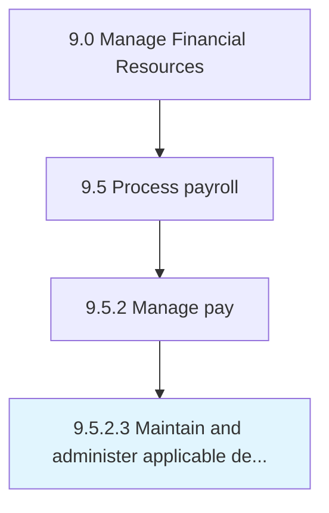

# Maintain and administer applicable deductions

> Processing salary deductions for tax purposes.

## Overview

Activity 9.5.2.3 is an activity within the Manage Financial Resources framework. 

Processing salary deductions for tax purposes. Keep and manage the details of every employee's salary deductions based on their expenses and investments during the year.

## Process Hierarchy



## Key Statistics

| Metric | Value |
|--------|-------|
| APQC Code | 10860 |
| Hierarchy ID | 9.5.2.3 |
| Level | Activity |
| Parent | [9.5.2](../) |
| Sub-Processes | 0 |


## GraphDL Semantic Structure

```
maintain.AndAdministerApplicableDeductions
```

| Component | Value | Description |
|-----------|-------|-------------|
| Verb | `maintain` | Primary action |
| Object | `and administer applicable deductions` | Direct object |


## Related Concepts

- ApplicableDeductions
- ApplicableDeductions


---

*Source: APQC PCF 10860 (9.5.2.3) - APQC*
