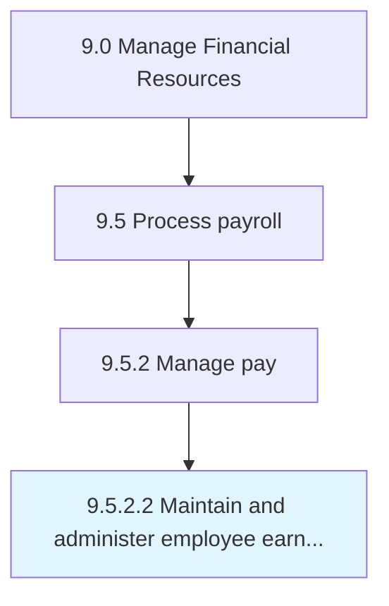

# Maintain and administer employee earnings information

> Tracking and oversee salary breakups of employees.

## Overview

Activity 9.5.2.2 is an activity within the Manage Financial Resources framework. 

Tracking and oversee salary breakups of employees. This process requires the organization to manage and update information pertaining to the structure of every employee's salary. This would involve the updating any changes to the salary structures of the employees, in a central repository which can be accessed by pertinent departments.

## Process Hierarchy



## Key Statistics

| Metric | Value |
|--------|-------|
| APQC Code | 10859 |
| Hierarchy ID | 9.5.2.2 |
| Level | Activity |
| Parent | [9.5.2](../) |
| Sub-Processes | 0 |


## GraphDL Semantic Structure

```
maintain.AndAdministerEmployeeEarningsInformation
```

| Component | Value | Description |
|-----------|-------|-------------|
| Verb | `maintain` | Primary action |
| Object | `and administer employee earnings information` | Direct object |


## Related Concepts

- EmployeeEarningsInformation
- EmployeeEarningsInformation


---

*Source: APQC PCF 10859 (9.5.2.2) - APQC*
