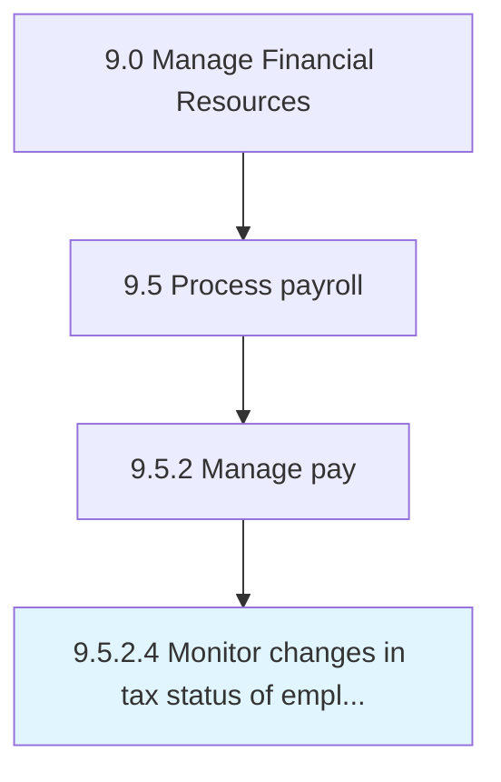

# Monitor changes in tax status of employees

> Tracking changes in the salary structure of employees for tax deductions.

## Overview

Activity 9.5.2.4 is an activity within the Manage Financial Resources framework. 

Tracking changes in the salary structure of employees for tax deductions.

## Process Hierarchy



## Key Statistics

| Metric | Value |
|--------|-------|
| APQC Code | 10861 |
| Hierarchy ID | 9.5.2.4 |
| Level | Activity |
| Parent | [9.5.2](../) |
| Sub-Processes | 0 |


## GraphDL Semantic Structure

```
monitor.Changes.in.TaxStatusOfEmployees
```

| Component | Value | Description |
|-----------|-------|-------------|
| Verb | `monitor` | Primary action |
| Object | `changes` | Direct object |
| Preposition | `in` | Relationship |
| PrepObject | `tax status of employees` | Indirect object |


## Related Concepts

- Changes
- TaxStatusOfEmployees


---

*Source: APQC PCF 10861 (9.5.2.4) - APQC*
