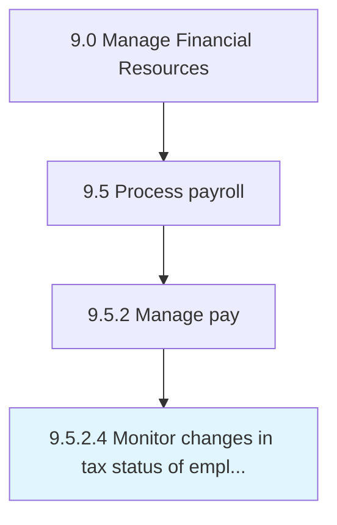
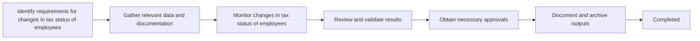

# Monitor changes in tax status of employees

> Tracking changes in the salary structure of employees for tax deductions.

## Overview

Activity 9.5.2.4 is an activity within the Payroll Management domain of the Manage Financial Resources framework.

Tracking changes in the salary structure of employees for tax deductions. This activity plays a critical role in ensuring that the organization maintains sound financial governance, operational efficiency, and regulatory compliance. It supports upstream planning and downstream execution by providing structured outputs that inform decision-making across finance and business operations. Effective execution of this activity requires coordination among finance professionals, process owners, and leadership stakeholders to ensure accuracy, timeliness, and alignment with organizational objectives.

## Process Hierarchy



## Process Flow



## Key Statistics

| Metric | Value |
|--------|-------|
| APQC Code | 10861 |
| Hierarchy ID | 9.5.2.4 |
| Level | Activity |
| Parent | [9.5.2](../) |
| Sub-Processes | 0 |

## GraphDL Semantic Structure

```graphdl
monitor.Changes.in.TaxStatusOfEmployees
```

| Component | Value | Description |
|-----------|-------|-------------|
| Verb | `monitor` | Primary action |
| Object | `changes` | Direct object |
| Preposition | `in` | Relationship |
| PrepObject | `tax status of employees` | Indirect object |

## RACI Matrix

| Activity | Responsible | Accountable | Consulted | Informed |
|----------|-------------|-------------|-----------|----------|
| Process payroll | Payroll Specialist | Payroll Manager | HR Department | Controller |
| File payroll taxes | Payroll Tax Analyst | Payroll Manager | Tax Department | CFO |
| Manage benefits deductions | Benefits Coordinator | HR Manager | Payroll Manager | Employees |

## Related Occupations

- [Financial Managers](/occupations/Management/FinancialManagers)
- [Accountants and Auditors](/occupations/Business/Financial/AccountantsAndAuditors)
- [Payroll and Timekeeping Clerks](/occupations/Administrative/PayrollAndTimekeepingClerks)
- [Compensation and Benefits Managers](/occupations/Management/CompensationAndBenefitsManagers)
- [Human Resources Specialists](/occupations/Business/Operations/HumanResourcesSpecialists)

## Related Departments

- Payroll
- Human Resources
- Finance & Accounting

## Industry Variations

### Retail

Manages high-volume, multi-location payroll with variable schedules, tips reporting, and seasonal workforce fluctuations.

### Healthcare

Handles complex pay structures including shift differentials, on-call pay, and credentialing-based compensation.

### Government

Administers structured pay grades, pension contributions, and union-negotiated compensation packages.

## KPIs & Metrics

| Metric | Description | Target |
|--------|-------------|--------|
| Payroll Accuracy Rate | Percentage of paychecks without errors | > 99.8% |
| Payroll Processing Time | Hours to complete payroll run | < 4 hours |
| Cost per Paycheck | Total payroll processing cost per check | < $5 |
| Tax Filing Timeliness | On-time payroll tax filings | 100% |

## Related Concepts

- Changes
- TaxStatusOfEmployees

---

*Source: APQC PCF 10861 (9.5.2.4) - APQC*