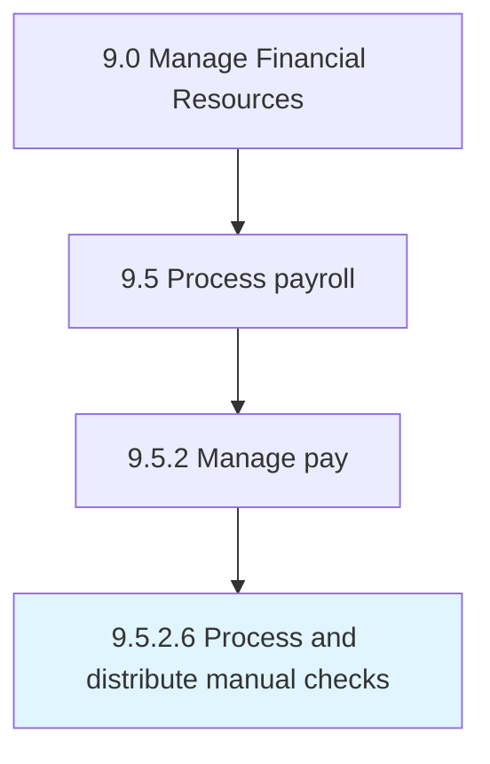

# Process and distribute manual checks

> Handling incorrect/omitted salary payments.

## Overview

Activity 9.5.2.6 is an activity within the Manage Financial Resources framework. 

## Process Hierarchy



## Key Statistics

| Metric | Value |
|--------|-------|
| APQC Code | 10863 |
| Hierarchy ID | 9.5.2.6 |
| Level | Activity |
| Parent | [9.5.2](../) |
| Sub-Processes | 0 |


## GraphDL Semantic Structure

```
process.AndDistributeManualChecks
```

| Component | Value | Description |
|-----------|-------|-------------|
| Verb | `process` | Primary action |
| Object | `and distribute manual checks` | Direct object |


## Related Concepts

- [ManualChecks](/concepts/ManualChecks)
- [ManualChecks](/concepts/ManualChecks)


---

*Source: APQC PCF 10863 (9.5.2.6) - APQC*
