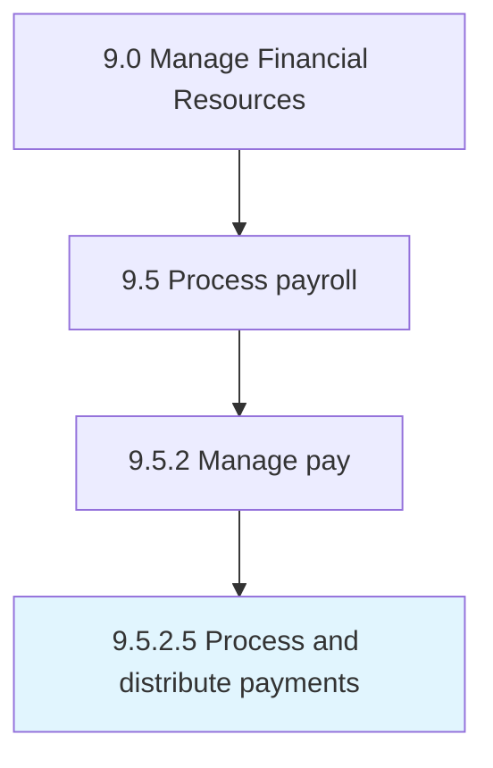

# Process and distribute payments

> Processing and distributing salaries to all employees.

## Overview

Activity 9.5.2.5 is an activity within the Manage Financial Resources framework. 

Processing and distributing salaries to all employees. Execute the payroll management function through the dispensation of employee salaries. Leverage a centralized database of all payroll expenses.

## Process Hierarchy



## Key Statistics

| Metric | Value |
|--------|-------|
| APQC Code | 10862 |
| Hierarchy ID | 9.5.2.5 |
| Level | Activity |
| Parent | [9.5.2](../) |
| Sub-Processes | 0 |


## GraphDL Semantic Structure

```
process.AndDistributePayments
```

| Component | Value | Description |
|-----------|-------|-------------|
| Verb | `process` | Primary action |
| Object | `and distribute payments` | Direct object |


## Related Concepts

- Payments
- Payments


---

*Source: APQC PCF 10862 (9.5.2.5) - APQC*
