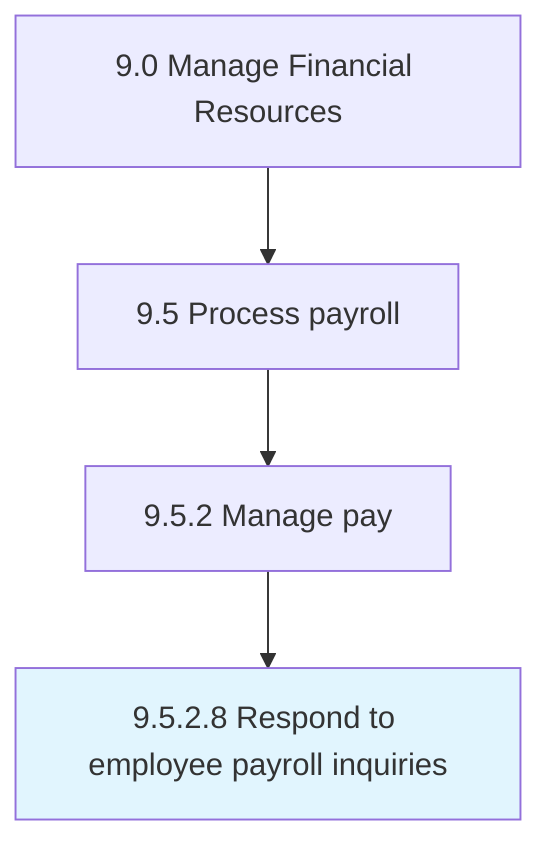

# Respond to employee payroll inquiries

> Addressing salary-related queries raised by employees.

## Overview

Activity 9.5.2.8 is an activity within the Manage Financial Resources framework. 

Addressing salary-related queries raised by employees.

## Process Hierarchy



## Key Statistics

| Metric | Value |
|--------|-------|
| APQC Code | 10865 |
| Hierarchy ID | 9.5.2.8 |
| Level | Activity |
| Parent | [9.5.2](../) |
| Sub-Processes | 0 |


## GraphDL Semantic Structure

```
respond.ToEmployeePayrollInquiries
```

| Component | Value | Description |
|-----------|-------|-------------|
| Verb | `respond` | Primary action |
| Object | `to employee payroll inquiries` | Direct object |


## Related Concepts

- EmployeePayrollInquiries


---

*Source: APQC PCF 10865 (9.5.2.8) - APQC*
