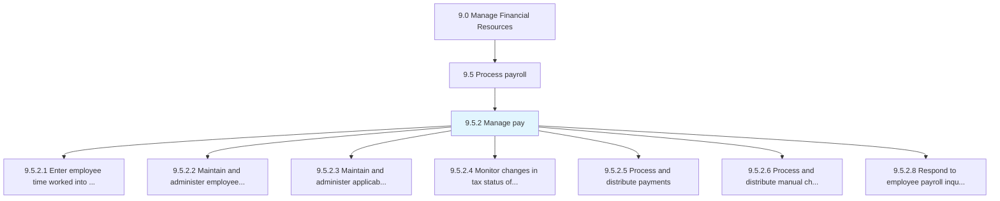
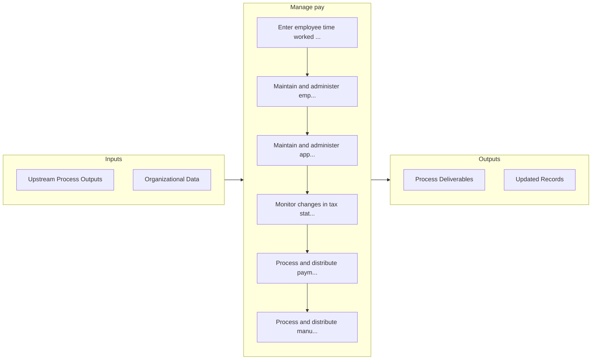

# Manage pay

> Managing the total payments made in employees payroll, including bonuses and compensation.

## Overview

Process 9.5.2 is a core process that defines the specific procedures for manage pay. 

Managing the total payments made in employees payroll, including bonuses and compensation.

## Process Hierarchy



## Key Statistics

| Metric | Value |
|--------|-------|
| APQC Code | 10754 |
| Hierarchy ID | 9.5.2 |
| Level | Process |
| Parent | [9.5](../) |
| Sub-Processes | 7 |


## GraphDL Semantic Structure

```
manage.Pay
```

| Component | Value | Description |
|-----------|-------|-------------|
| Verb | `manage` | Primary action |
| Object | `pay` | Direct object |


## Process Flow



## Sub-Processes

| Process | Hierarchy ID | Description |
|---------|-------------|-------------|
| [Enter employee time worked into payroll system](./EnterEmployeeTimeWorkedIntoPayrollSystem) | 9.5.2.1 | Tracking the number of hours worked for the payroll system |
| [Maintain and administer employee earnings information](./MaintainAndAdministerEmployeeEarningsInformation) | 9.5.2.2 | Tracking and oversee salary breakups of employees |
| [Maintain and administer applicable deductions](./MaintainAndAdministerApplicableDeductions) | 9.5.2.3 | Processing salary deductions for tax purposes |
| [Monitor changes in tax status of employees](./MonitorChangesInTaxStatusOfEmployees) | 9.5.2.4 | Tracking changes in the salary structure of employees for tax deductions |
| [Process and distribute payments](./ProcessAndDistributePayments) | 9.5.2.5 | Processing and distributing salaries to all employees |
| [Process and distribute manual checks](./ProcessAndDistributeManualChecks) | 9.5.2.6 | Handling incorrect/omitted salary payments |
| [Respond to employee payroll inquiries](./RespondToEmployeePayrollInquiries) | 9.5.2.8 | Addressing salary-related queries raised by employees |


## Related Concepts

- [Pay](/concepts/Pay)


---

*Source: APQC PCF 10754 (9.5.2) - APQC*
