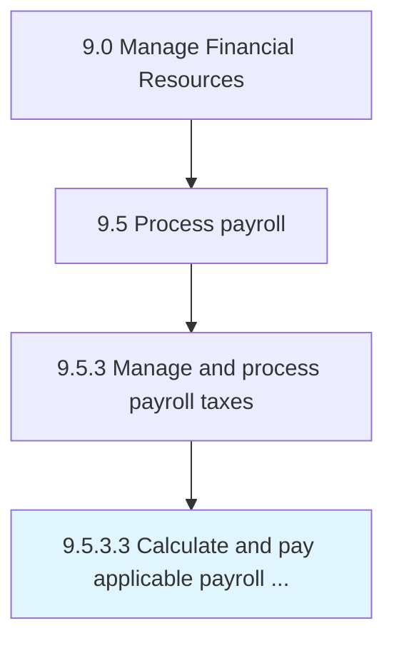

# Calculate and pay applicable payroll taxes

> Paying tax according to appropriate deductions made from salaries.

## Overview

Activity 9.5.3.3 is an activity within the Manage Financial Resources framework. 

Paying tax according to appropriate deductions made from salaries. Calculate and pay the tax liabilities according to the salaries and tax regulations of employees with the help of certified chartered accountants.

## Process Hierarchy



## Key Statistics

| Metric | Value |
|--------|-------|
| APQC Code | 10866 |
| Hierarchy ID | 9.5.3.3 |
| Level | Activity |
| Parent | [9.5.3](../) |
| Sub-Processes | 0 |


## GraphDL Semantic Structure

```
calculate.AndPayApplicablePayrollTaxes
```

| Component | Value | Description |
|-----------|-------|-------------|
| Verb | `calculate` | Primary action |
| Object | `and pay applicable payroll taxes` | Direct object |


## Related Concepts

- ApplicablePayrollTaxes
- ApplicablePayrollTaxes


---

*Source: APQC PCF 10866 (9.5.3.3) - APQC*
