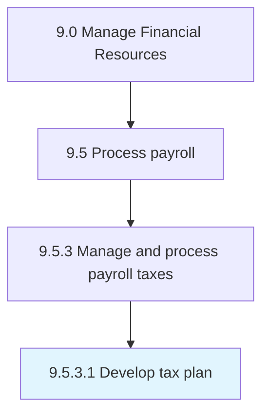

# Develop tax plan

> Devising a method to minimize payroll tax liability by means of allowances, deductions, exclusions or exemptions.

## Overview

Activity 9.5.3.1 is an activity within the Manage Financial Resources framework. 

Devising a method to minimize payroll tax liability by means of allowances, deductions, exclusions or exemptions.

## Process Hierarchy



## Key Statistics

| Metric | Value |
|--------|-------|
| APQC Code | 14075 |
| Hierarchy ID | 9.5.3.1 |
| Level | Activity |
| Parent | [9.5.3](../) |
| Sub-Processes | 0 |


## GraphDL Semantic Structure

```
develop.TaxPlan
```

| Component | Value | Description |
|-----------|-------|-------------|
| Verb | `develop` | Primary action |
| Object | `tax plan` | Direct object |


## Related Concepts

- TaxPlan


---

*Source: APQC PCF 14075 (9.5.3.1) - APQC*
