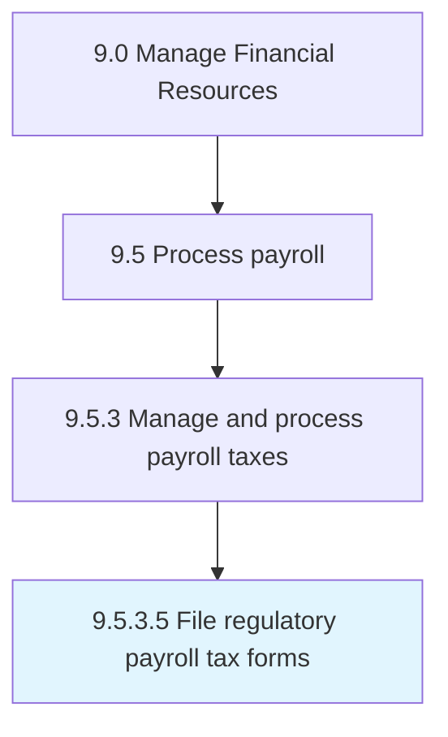

# File regulatory payroll tax forms

> Filling taxes, and highlighting different sources of income and expenditures made.

## Overview

Activity 9.5.3.5 is an activity within the Manage Financial Resources framework. 

Filling taxes, and highlighting different sources of income and expenditures made.

## Process Hierarchy



## Key Statistics

| Metric | Value |
|--------|-------|
| APQC Code | 10868 |
| Hierarchy ID | 9.5.3.5 |
| Level | Activity |
| Parent | [9.5.3](../) |
| Sub-Processes | 0 |


## GraphDL Semantic Structure

```
file.RegulatoryPayrollTaxForms
```

| Component | Value | Description |
|-----------|-------|-------------|
| Verb | `file` | Primary action |
| Object | `regulatory payroll tax forms` | Direct object |


## Related Concepts

- RegulatoryPayrollTaxForms


---

*Source: APQC PCF 10868 (9.5.3.5) - APQC*
