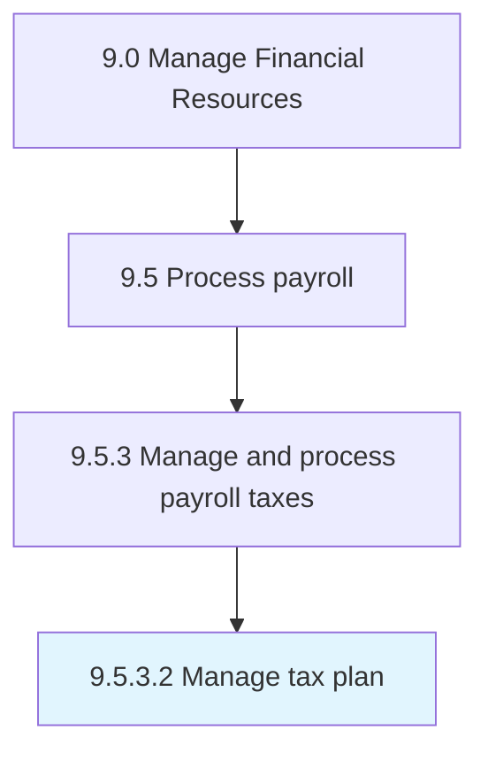

# Manage tax plan

> Overseeing maintaining the reduction of payroll taxes [14075].

## Overview

Activity 9.5.3.2 is an activity within the Manage Financial Resources framework. 

Overseeing maintaining the reduction of payroll taxes [14075].

## Process Hierarchy



## Key Statistics

| Metric | Value |
|--------|-------|
| APQC Code | 14076 |
| Hierarchy ID | 9.5.3.2 |
| Level | Activity |
| Parent | [9.5.3](../) |
| Sub-Processes | 0 |


## GraphDL Semantic Structure

```
manage.TaxPlan
```

| Component | Value | Description |
|-----------|-------|-------------|
| Verb | `manage` | Primary action |
| Object | `tax plan` | Direct object |


## Related Concepts

- [TaxPlan](/concepts/TaxPlan)


---

*Source: APQC PCF 14076 (9.5.3.2) - APQC*
