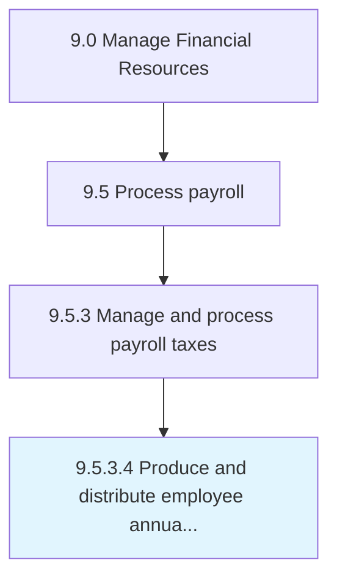

# Produce and distribute employee annual tax statements

> Providing tax deductions statements created by certified chartered accountants to every employee for their reference or refunds.

## Overview

Activity 9.5.3.4 is an activity within the Manage Financial Resources framework. 

Providing tax deductions statements created by certified chartered accountants to every employee for their reference or refunds.

## Process Hierarchy



## Key Statistics

| Metric | Value |
|--------|-------|
| APQC Code | 10867 |
| Hierarchy ID | 9.5.3.4 |
| Level | Activity |
| Parent | [9.5.3](../) |
| Sub-Processes | 0 |


## GraphDL Semantic Structure

```
produce.AndDistributeEmployeeAnnualTaxStatements
```

| Component | Value | Description |
|-----------|-------|-------------|
| Verb | `produce` | Primary action |
| Object | `and distribute employee annual tax statements` | Direct object |


## Related Concepts

- [EmployeeAnnualTaxStatements](/concepts/EmployeeAnnualTaxStatements)
- [EmployeeAnnualTaxStatements](/concepts/EmployeeAnnualTaxStatements)


---

*Source: APQC PCF 10867 (9.5.3.4) - APQC*
