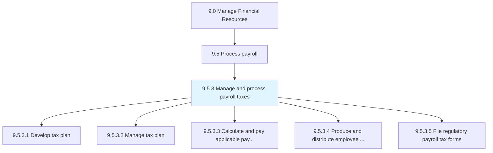
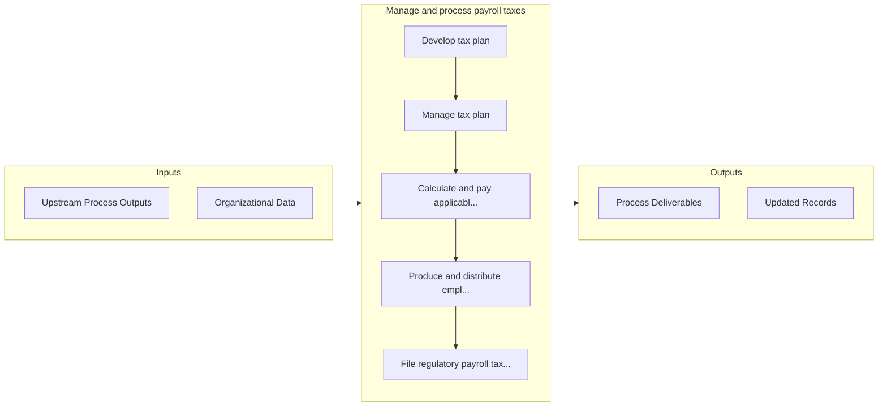

# Manage and process payroll taxes

> Deducting and paying taxes from employees' salaries.

## Overview

Process 9.5.3 is a core process that defines the specific procedures for manage and process payroll taxes. 

Deducting and paying taxes from employees' salaries.

## Process Hierarchy



## Key Statistics

| Metric | Value |
|--------|-------|
| APQC Code | 10755 |
| Hierarchy ID | 9.5.3 |
| Level | Process |
| Parent | [9.5](../) |
| Sub-Processes | 5 |


## GraphDL Semantic Structure

```
manage.AndProcessPayrollTaxes
```

| Component | Value | Description |
|-----------|-------|-------------|
| Verb | `manage` | Primary action |
| Object | `and process payroll taxes` | Direct object |


## Process Flow



## Sub-Processes

| Process | Hierarchy ID | Description |
|---------|-------------|-------------|
| [Develop tax plan](./DevelopTaxPlan) | 9.5.3.1 | Devising a method to minimize payroll tax liability by means of allowances, deductions, exclusions o |
| [Manage tax plan](./ManageTaxPlan) | 9.5.3.2 | Overseeing maintaining the reduction of payroll taxes [14075] |
| [Calculate and pay applicable payroll taxes](./CalculateAndPayApplicablePayrollTaxes) | 9.5.3.3 | Paying tax according to appropriate deductions made from salaries |
| [Produce and distribute employee annual tax statements](./ProduceAndDistributeEmployeeAnnualTaxStatements) | 9.5.3.4 | Providing tax deductions statements created by certified chartered accountants to every employee for |
| [File regulatory payroll tax forms](./FileRegulatoryPayrollTaxForms) | 9.5.3.5 | Filling taxes, and highlighting different sources of income and expenditures made |


## Related Concepts

- PayrollTaxes
- PayrollTaxes


---

*Source: APQC PCF 10755 (9.5.3) - APQC*
