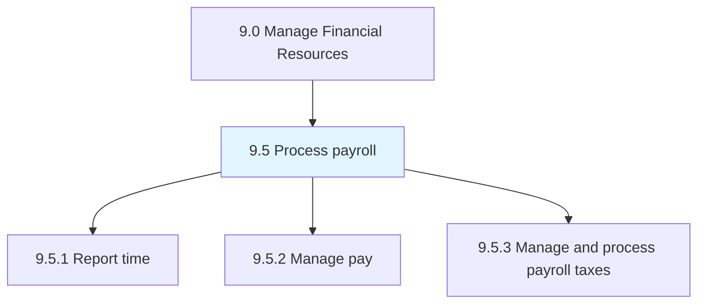
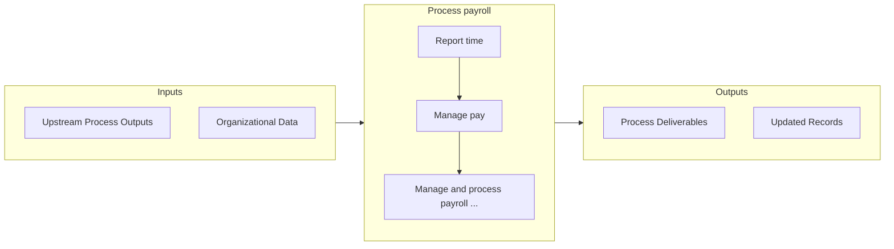

# Process payroll

> Handling reporting time, managing pay, and processing taxes from salaries.

## Overview

Group 9.5 is a process group within APQC Category 9.0 (Manage Financial Resources). 

Handling reporting time, managing pay, and processing taxes from salaries. Pay employees. Withhold taxes. Confirm the correct funds are paid to the correct government agency.

## Process Hierarchy



## Key Statistics

| Metric | Value |
|--------|-------|
| APQC Code | 10732 |
| Hierarchy ID | 9.5 |
| Level | Group |
| Parent | [9](../) |
| Sub-Processes | 3 |


## Process Overview

Finance processes manage financial planning, accounting, treasury, and controls to ensure financial health. This process focuses on process payroll, which is essential for organizational effectiveness and achieving business objectives.

## Key Metrics

| Metric | Description | Target |
|--------|-------------|--------|
| Days sales outstanding | Measure of days sales outstanding | Target varies by organization |
| Budget variance | Measure of budget variance | Target varies by organization |
| Cash conversion cycle | Measure of cash conversion cycle | Target varies by organization |
| Cost per transaction | Measure of cost per transaction | Target varies by organization |

## Related Departments

- [Finance](/departments/Finance)
- [Accounting](/departments/Accounting)
- [Treasury](/departments/Treasury)

## Related Occupations

- [Financial Managers](/occupations/Management/FinancialManagers)
- [Accountants](/occupations/Business/AccountantsAndAuditors)
- [Financial Analysts](/occupations/Business/FinancialAnalysts)

## RACI Matrix

| Activity | Responsible | Accountable | Consulted | Informed |
|----------|-------------|-------------|-----------|----------|
| Plan | Process Owner | Manager | Stakeholders | Team |
| Execute | Team | Process Owner | Manager | Stakeholders |
| Monitor | Analyst | Manager | Process Owner | Leadership |
| Improve | Process Owner | Manager | Team | Stakeholders |

## GraphDL Semantic Structure

```graphdl
process.Payroll
```

| Component | Value | Description |
|-----------|-------|-------------|
| Verb | `process` | Primary action |
| Object | `payroll` | Direct object |


## Process Flow



## Sub-Processes

| Process | Hierarchy ID | Description |
|---------|-------------|-------------|
| [Report time](./9.5.1-ReportTime/) | 9.5.1 | Recording the reporting time of employees on-site |
| [Manage pay](./9.5.2-ManagePay/) | 9.5.2 | Managing the total payments made in employees payroll, including bonuses and compensation |
| [Manage and process payroll taxes](./9.5.3-ManageProcessPayrollTaxes/) | 9.5.3 | Deducting and paying taxes from employees' salaries |


## Related Concepts

- Payroll


---

*Source: APQC PCF 10732 (9.5) - APQC*
