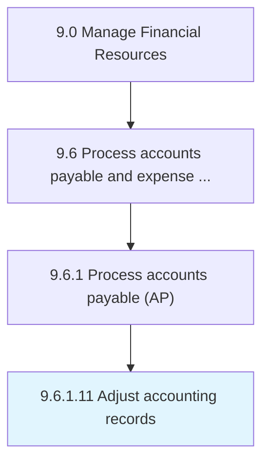

# Adjust accounting records

> Rectifying for alterations occurred in accounts while recording.

## Overview

Activity 9.6.1.11 is an activity within the Manage Financial Resources framework. 

Rectifying for alterations occurred in accounts while recording.

## Process Hierarchy



## Key Statistics

| Metric | Value |
|--------|-------|
| APQC Code | 10879 |
| Hierarchy ID | 9.6.1.11 |
| Level | Activity |
| Parent | [9.6.1](../) |
| Sub-Processes | 0 |


## GraphDL Semantic Structure

```
adjust.AccountingRecords
```

| Component | Value | Description |
|-----------|-------|-------------|
| Verb | `adjust` | Primary action |
| Object | `accounting records` | Direct object |


## Related Concepts

- [AccountingRecords](/concepts/AccountingRecords)


---

*Source: APQC PCF 10879 (9.6.1.11) - APQC*
