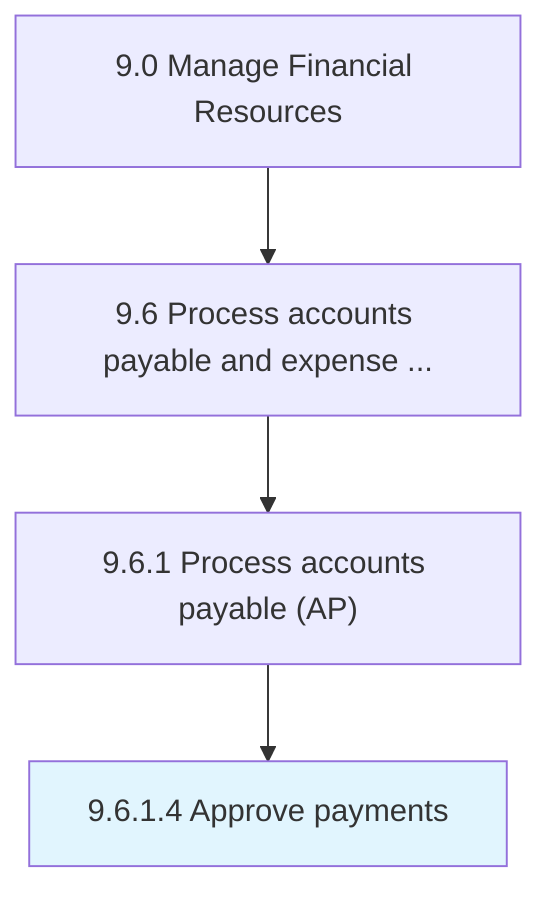

# Approve payments

> Processing payments for products/services.

## Overview

Activity 9.6.1.4 is an activity within the Manage Financial Resources framework. 

## Process Hierarchy



## Key Statistics

| Metric | Value |
|--------|-------|
| APQC Code | 10872 |
| Hierarchy ID | 9.6.1.4 |
| Level | Activity |
| Parent | [9.6.1](../) |
| Sub-Processes | 0 |


## GraphDL Semantic Structure

```
approve.Payments
```

| Component | Value | Description |
|-----------|-------|-------------|
| Verb | `approve` | Primary action |
| Object | `payments` | Direct object |


## Related Concepts

- [Payments](/concepts/Payments)


---

*Source: APQC PCF 10872 (9.6.1.4) - APQC*
