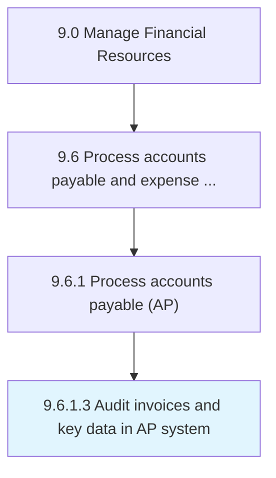

# Audit invoices and key data in AP system

> Monitoring and evaluating bills registered in accounts books.

## Overview

Activity 9.6.1.3 is an activity within the Manage Financial Resources framework. 

Monitoring and evaluating bills registered in accounts books. Check all invoices. Maintain records.

## Process Hierarchy



## Key Statistics

| Metric | Value |
|--------|-------|
| APQC Code | 10871 |
| Hierarchy ID | 9.6.1.3 |
| Level | Activity |
| Parent | [9.6.1](../) |
| Sub-Processes | 0 |


## GraphDL Semantic Structure

```
audit.InvoicesAndKeyData.in.APSystem
```

| Component | Value | Description |
|-----------|-------|-------------|
| Verb | `audit` | Primary action |
| Object | `invoices and key data` | Direct object |
| Preposition | `in` | Relationship |
| PrepObject | `AP system` | Indirect object |


## Related Concepts

- InvoicesData
- APSystem
- KeyData
- APSystem


---

*Source: APQC PCF 10871 (9.6.1.3) - APQC*
