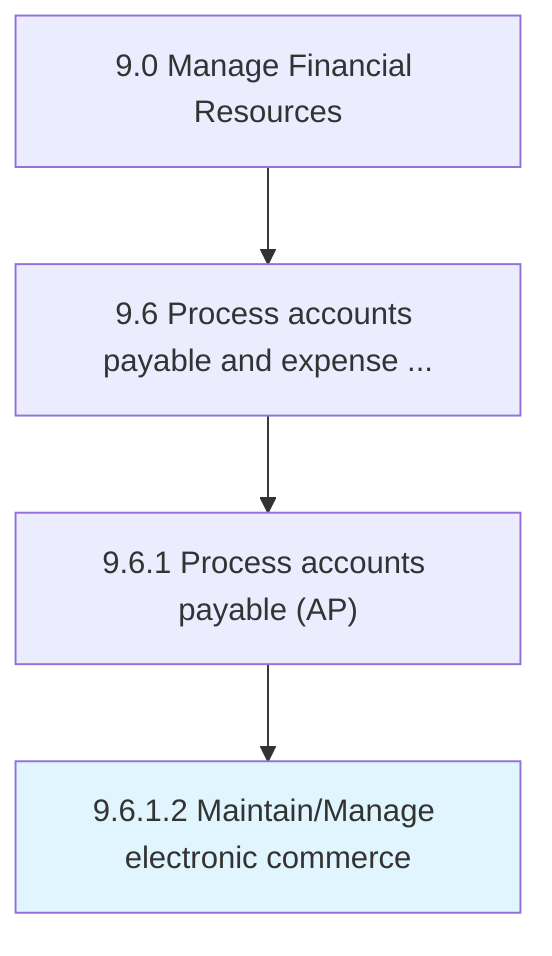

# Maintain/Manage electronic commerce

> Tracking all online transactions.

## Overview

Activity 9.6.1.2 is an activity within the Manage Financial Resources framework. 

## Process Hierarchy



## Key Statistics

| Metric | Value |
|--------|-------|
| APQC Code | 10870 |
| Hierarchy ID | 9.6.1.2 |
| Level | Activity |
| Parent | [9.6.1](../) |
| Sub-Processes | 0 |


## GraphDL Semantic Structure

```
maintain/manage.ElectronicCommerce
```

| Component | Value | Description |
|-----------|-------|-------------|
| Verb | `maintain/manage` | Primary action |
| Object | `electronic commerce` | Direct object |


## Related Concepts

- ElectronicCommerce
- ElectronicCommerce


---

*Source: APQC PCF 10870 (9.6.1.2) - APQC*
