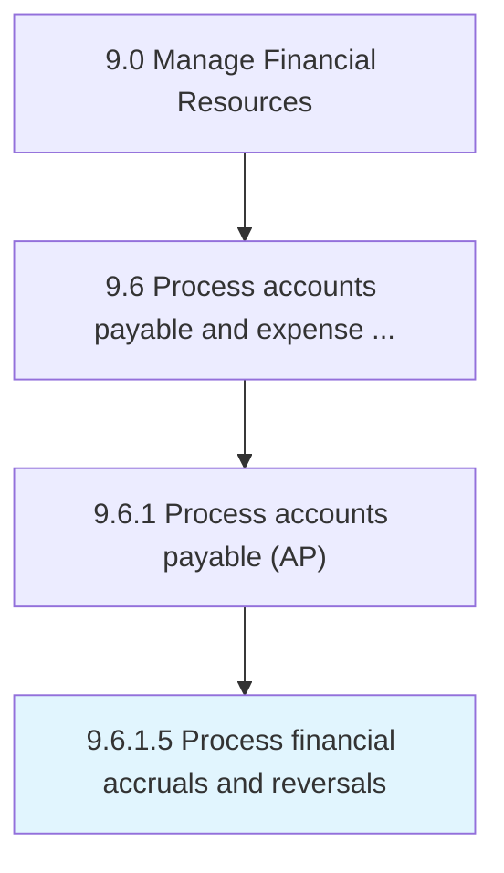

# Process financial accruals and reversals

> Handling transactions for accruals and reversals.

## Overview

Activity 9.6.1.5 is an activity within the Manage Financial Resources framework. 

Handling transactions for accruals and reversals. Record transactions in the books of accounts on an accrual basis (irrespective of the actual cash flow) and reversals basis (cancel out the adjusting entries) for balancing accounts.

## Process Hierarchy



## Key Statistics

| Metric | Value |
|--------|-------|
| APQC Code | 10873 |
| Hierarchy ID | 9.6.1.5 |
| Level | Activity |
| Parent | [9.6.1](../) |
| Sub-Processes | 0 |


## GraphDL Semantic Structure

```
process.FinancialAccrualsAndReversals
```

| Component | Value | Description |
|-----------|-------|-------------|
| Verb | `process` | Primary action |
| Object | `financial accruals and reversals` | Direct object |


## Related Concepts

- [FinancialAccruals](/concepts/FinancialAccruals)
- [Reversals](/concepts/Reversals)


---

*Source: APQC PCF 10873 (9.6.1.5) - APQC*
