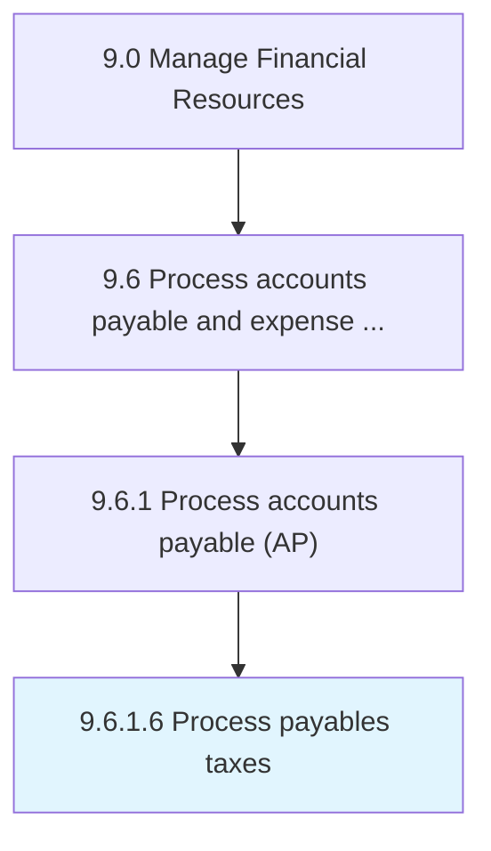

# Process payables taxes

> Filing the amount of taxes that a company owes as of the balance sheet date.

## Overview

Activity 9.6.1.6 is an activity within the Manage Financial Resources framework. 

Filing the amount of taxes that a company owes as of the balance sheet date. Prepare tax returns, including the income tax filing for an individual or business entity from earnings.

## Process Hierarchy



## Key Statistics

| Metric | Value |
|--------|-------|
| APQC Code | 10874 |
| Hierarchy ID | 9.6.1.6 |
| Level | Activity |
| Parent | [9.6.1](../) |
| Sub-Processes | 0 |


## GraphDL Semantic Structure

```
process.PayablesTaxes
```

| Component | Value | Description |
|-----------|-------|-------------|
| Verb | `process` | Primary action |
| Object | `payables taxes` | Direct object |


## Related Concepts

- [PayablesTaxes](/concepts/PayablesTaxes)


---

*Source: APQC PCF 10874 (9.6.1.6) - APQC*
