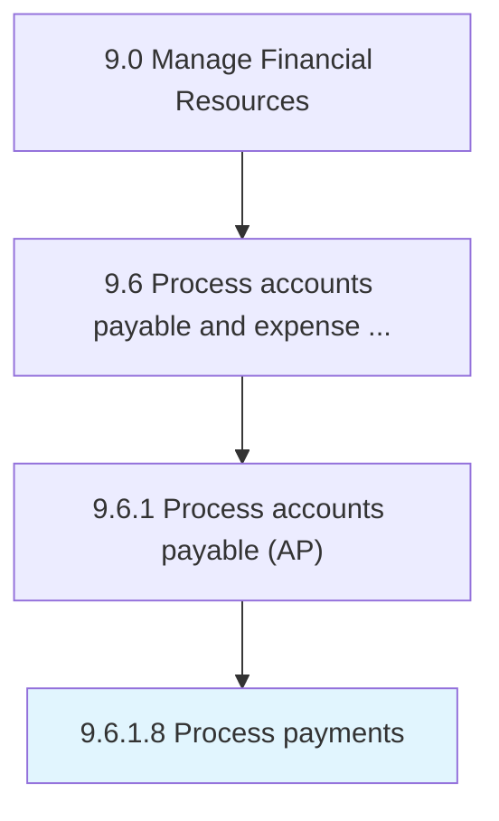

# Process payments

> Making payments for products/services on due dates (payment cycle) decided by parties involved.

## Overview

Activity 9.6.1.8 is an activity within the Manage Financial Resources framework. 

Making payments for products/services on due dates (payment cycle) decided by parties involved.

## Process Hierarchy



## Key Statistics

| Metric | Value |
|--------|-------|
| APQC Code | 10876 |
| Hierarchy ID | 9.6.1.8 |
| Level | Activity |
| Parent | [9.6.1](../) |
| Sub-Processes | 0 |


## GraphDL Semantic Structure

```
process.Payments
```

| Component | Value | Description |
|-----------|-------|-------------|
| Verb | `process` | Primary action |
| Object | `payments` | Direct object |


## Related Concepts

- Payments


---

*Source: APQC PCF 10876 (9.6.1.8) - APQC*
