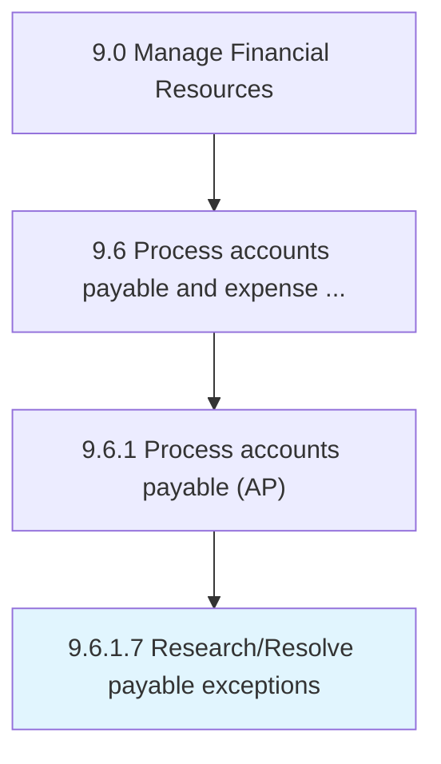

# Research/Resolve payable exceptions

> Resolving any atypical or inconsistent situation concerning payments to be made by the organization.

## Overview

Activity 9.6.1.7 is an activity within the Manage Financial Resources framework. 

Resolving any atypical or inconsistent situation concerning payments to be made by the organization. Address any exceptional case of accounts payable on an ad hoc basis, by seeking counsel or carrying out any necessary research.

## Process Hierarchy



## Key Statistics

| Metric | Value |
|--------|-------|
| APQC Code | 10875 |
| Hierarchy ID | 9.6.1.7 |
| Level | Activity |
| Parent | [9.6.1](../) |
| Sub-Processes | 0 |


## GraphDL Semantic Structure

```
research/resolve.PayableExceptions
```

| Component | Value | Description |
|-----------|-------|-------------|
| Verb | `research/resolve` | Primary action |
| Object | `payable exceptions` | Direct object |


## Related Concepts

- PayableExceptions
- PayableExceptions


---

*Source: APQC PCF 10875 (9.6.1.7) - APQC*
